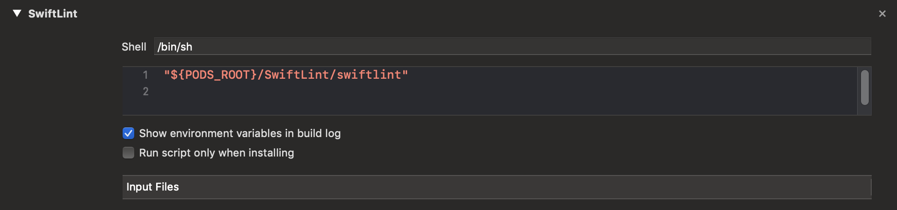

## Phần 4: Auto Review Code and Report

#### 4.1 Sử dụng SwiftLint

- **Khái niệm:**
  - SwiftLint: 
    - Là một **tool** dùng để kiểm tra code (hay gọi là *review code*) theo **conventions** của Swift
    - Có thể bắt gặp nhiều *Lint* khác cho nhiều loại ngôn ngữ khác
    - Về conventions thì mình có thể sử dụng các `rule` mặc định hoặc có thể tự `custom` theo conventions của team hay của dự án
    - Link: <https://github.com/realm/SwiftLint>
- **Cài đặt** dùng `CocoaPod`

```ruby
pod 'SwiftLint'
```

- Thêm script vào Xcode để chạy `swiftlint`

  - Vào `Build Phases` > `New Run Script Phase` 
  - Đoạn script như sau:

  ```ruby
  "${PODS_ROOT}/SwiftLint/swiftlint"
  ```

  Xem hình dưới đây cho rõ



​	Build project và sẽ thấy `Swiftlint` thông báo các `warning` và `error`

#### 4.2 Sử dụng SwiftLint với CI

- Để sử dụng được `SwiftLint` với CI hay ở đây là `Travis CI` thì:
  - Tạo 1 `yaml file` và đặt ở thư mục gốc. CI sẽ tự động quét và chạy
  - Đặt tên sau `.swiftlint.yml`
- Nội dung file tham khảo

```ruby
disabled_rules: # rule identifiers to exclude from running
  - colon
  - comma
  - control_statement
opt_in_rules: # some rules are only opt-in
  - empty_count
  # Find all the available rules by running:
  # swiftlint rules
excluded: # paths to ignore during linting. Takes precedence over `included`.
  - Carthage
  - Pods
  - vendor
analyzer_rules: # Rules run by `swiftlint analyze` (experimental)
  - explicit_self

# configurable rules can be customized from this configuration file
# binary rules can set their severity level
force_cast: warning # implicitly
force_try:
  severity: warning # explicitly
# rules that have both warning and error levels, can set just the warning level
# implicitly
line_length: 110
# they can set both implicitly with an array
type_body_length:
  - 300 # warning
  - 400 # error
# or they can set both explicitly
file_length:
  warning: 500
  error: 1200
# naming rules can set warnings/errors for min_length and max_length
# additionally they can set excluded names
type_name:
  min_length: 4 # only warning
  max_length: # warning and error
    warning: 40
    error: 50
  excluded: iPhone # excluded via string
identifier_name:
  min_length: # only min_length
    error: 3 # only error
  excluded: # excluded via string array
    - id
    - URL
    - GlobalAPIKey
reporter: "xcode" # reporter type (xcode, json, csv, checkstyle, junit, html, emoji, sonarqube, markdown)
```

- Ý nghĩa các từ khoá và lệnh trong file trên thì các bạn từ tìm hiểu và nói chung thì cũng không khó mấy, nên vọc vọc tí là ra
- **Chú ý:**
  - Rule : các luật (rule) cho conventions
  - Thư mục và đường dẫn : nếu bạn có sử dụng thì hãy check, vì ghi thư mục trong file nhưng nó ko có trong repo thì không `pass` đc CI
- Các trường hợp chạy `SwiftLint` oke thì bản build sẽ được kiểm tra, nếu bản build `failed` thì sẽ báo như sau:

```
Testing failed:
	Identifier Name Violation: Variable name should be between 4 and 40 characters long: 'key' (identifier_name)
	Testing cancelled because the build failed.
** TEST FAILED **
```

​	Còn đúng thì âm thầm không show ra gì, nên cứ bình tĩnh mà tiến tới tiếp bước sau, ahihi

#### 4.3 Report/Comment lên GitHub

​	Để có thể post/comment các kết quả của `SwiftLint` lên GitHub thì chúng ta sử dụng `LinterBot`

- **Khái niệm**

  - **Linterbot**
    - Là 1 con `BOT` , nhiệm vụ của nó là đọc `out put` của `SwiftLint` và comment vào `pull request` trên GitHub
    - Cần có được `access_token` từ account của dev mới có thể post comment vào
  - Link tham khảo: https://github.com/guidomb/linterbot

- **Cài đặt:**

  - Thêm vào `GemFile`

  ```ruby
  gem 'linterbot'
  ```

  - Install

  ```ruby
  gem install linterbot
  ```

- **Sử dụng ở Local**

  ```ruby
  swiftlint lint --reporter json | linterbot REPOSITORY PULL_REQUEST_NUMBER
  ```

- **Sử dụng với Travis CI**

  - Create **bash** script (bash là gì thì tự tìm hiểu nha)

    - Tạo thư mục `bin` (trong thư mục gốc) > tạo 1 file (**ko có đuôi**) và edit như sau:

    ```bash
    #!/bin/bash
    
    if [ "$TRAVIS_PULL_REQUEST" != "false" ]
    then
      ./Pods/SwiftLint/swiftlint --reporter json > swiftlint-report.json || false
      linterbot $TRAVIS_REPO_SLUG $TRAVIS_PULL_REQUEST < swiftlint-report.json
    fi
    ```

    - Chú ý đường dẫn sau `./Pods/SwiftLint/swiftlint` Vì đó là nơi mà mình `pod` swiftlint về nên trỏ vào đúng nó mới chạy đc. Lỗi ngu ngu này mất cả tiếng đồng hồ nếu copy dán không suy nghĩ.
    - Saved file lại với tên là `linter`
    - Edit quyền để tránh các lỗi về `Permission denied` như sau (khi chạy trên CI)

    ```
    0.01s$ ./bin/linter
    /Users/travis/.travis/functions: line 104: ./bin/linter: Permission denied
    The command “./bin/linter” exited with 126.
    ```

    - Lệnh set lại quyền truy cập như sau (dành cho các thanh niên không biết)

    ```bash
     chmod +x ./bin/linter
    ```

  - Edit `.travis.yml`

    - Thêm các lệnh cài đặt `linterbot` 

    ```ruby
    before_install:
      - bundle install
      - gem install linterbot
      - bundle exec pod install --repo-update
    ```

    - Thêm lệnh thực hiện `script` linter

    ```ruby
    script:
      - ./bin/linter
    ```

  - File `.travis.yml` đẹp như sau:

  ```ruby
  language: objective-c
  osx_image: xcode10.1
  cache:
    - bundler
    - cocoapods
  xcode_workspace: TheLastProject.xcworkspace
  xcode_scheme: TheLastProject_Development
  xcode_destination: platform=iOS Simulator,OS=12.1,name=iPhone X
  before_install:
    - bundle install
    - gem install linterbot
    - bundle exec pod install --repo-update
  install:
    - set -o pipefail
    - sudo systemsetup -settimezone Asia/Ho_Chi_Minh
    - bundle install --path=vendor/bundle --jobs 4 --retry 3
  script:
    - ./bin/linter
  ```

- **access_key**

  - Để có thể `post/comment` lên được GitHub thì cần có quyền truy cập từ GitHub
  - Tham khảo cách tạo `access_key` :  <https://help.github.com/en/articles/creating-a-personal-access-token-for-the-command-line>
  - Để đảm bảo tính **bảo mật** thì các `key` sẽ được lưu trữ trên trang `Travis CI`.  Vào setting > tạo 1 `GITHUB_ACCESS_TOKEN`

  

#### 4.4 Kết quả

- Tiến hành commit và gởi pull request để CI chạy và kiểm tra. Nếu đầy đủ các kết quả sau trên `pull request` thì chúc mừng bạn đã pass qua bước này, ahihi
  - Pass đc CI
  - Xuất hiện Comments của `SwiftLint` thông qua `linterbot` 


