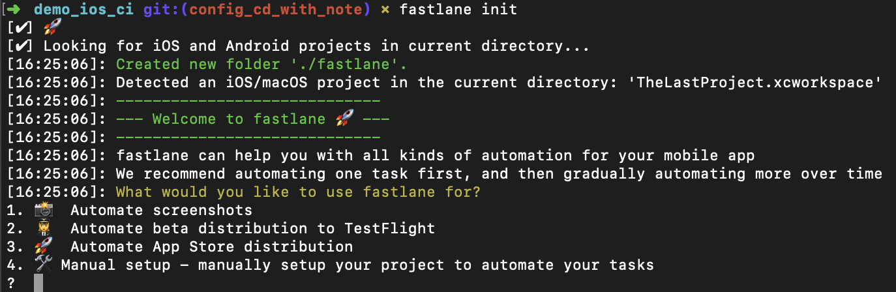
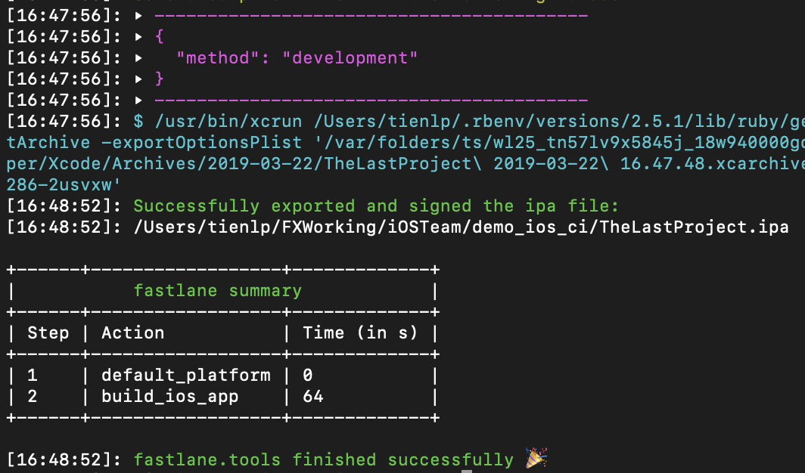
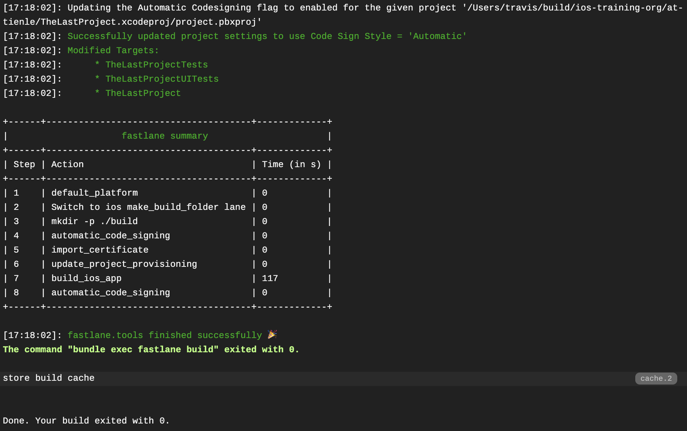

## <u>Phần 6:</u> Fastlane đại cương

#### 6.1. **Fastlane là gì ?** 

- Fastlane là một công cụ giúp cho việc release sản phẩm của chúng ta trở nên dễ dàng hơn , nhanh hơn . 
- Nó xử lý tất cả những công việc dườm dà như tạo screenshot , xử lý với code signing và release ứng dụng lên store .


- **Ta có thể làm gì với fastlane ?**
  - Xác định rõ việc deploy sản phẩn , bản beta hay testing
  - Deploy tới bất kỳ máy tính nào , bao gồm cả CI server
  - Mở rộng , tối ưu hóa các chức năng
  - Dễ dàng setup trong vài phút
  - Không cần phải nhớ các câu lệnh command phức tạp , chỉ cần fastlane là đủ
  - Lưu trữ mọi thứ trên Git , dễ config
  - Tự động truyền thông tin theo tưng bước (ví dụ : đường dẫn đến file IPA)
  - Tiết kiệm thời gian cho bản cập nhật cũng như release
  - Thực hiện đầy đủ các qui trinh delivery sản phẩn
  - Cấu hình linh hoạt , mọi thứ chỉ cần config trong Fastfile
  - Có khoảng hơn 170 chức năng được tích hợp sẵn
  - Hỗ trợ cho cả iOS , MacOS , Android

#### 6.2. Cài đặt

- Thêm vào GemFile

  - Lời khuyên cho bạn thì cần phải nhớ là sử dụng `version` mới nhất của Fastlane để sử dụng `full` các tính năng của nó
  - Đó là kinh nghiệm xương máu `gem 'fastlane', '2.118.1'`

  ```ruby
  gem 'fastlane'
  ```

- Chạy các lệnh ở local **trước (vì cần thiết)** để `install`

  Chạy để cập nhật các bundle

  ```bash
  bundle install
  ```

  Chạy Fastlane

  ```bash
  gem install fastlane
  ```

- **Init Fastlane**

  - Chạy lệnh init trước (trên Travis CI thì mình ko chạy lệnh này)

  ```
  fastlane init
  ```

  - Chọn `option 4` để sử dụng. Các option khác thì tìm hiểu sau nhoé. Ahihi
  - Chạy xong thì sinh ra 1 thư mục `fastlane` trong đó có 2 file
    - Appfile
    - Fastfile

  

#### 6.3. Giải thích về các thành phần

- **Appfile** : 
  - Đây là nơi bạn khai báo các thông tin liên quan tới việc build app và nó cũng sẽ tự động sinh ra một số trường nếu bạn chọn 1 trong số 3 option phía trên:
    - app_identifier
    - apple_id
    - itc_team_id 
    - team_id
- **Fastfile** : 
  - Đây là file mà bạn sẽ giao tiếp để viết các đoạn script để cấu hình cho fastlane. 
  - Để viết được script cho fastlane thì tốt nhất là bạn nên đọc qua [Fastlane Documentation](https://docs.fastlane.tools/) để hiểu cú pháp, nó rất là dễ và ít thôi nên bạn hãy xem qua nó để tránh việc mất thời gian để dò lỗi cú pháp. 
  - Để mở Fastfile thì bạn có thể dùng vim, TextEdit nhưng mình recommend các bạn sử dụng [atom](https://atom.io/) để mở trông sẽ đẹp và dễ nhìn hơn.

#### 6.4. Cấu hình cho Fastfile

​	Nào bây giờ chúng ta thử viết một đoạn script để bắt fastlane build thử app xem có lỗi gì không nhé.

```bash
default_platform(:ios)

platform :ios do
  desc "Try to test app"
  lane :test do
    run_tests(scheme: "PhotoMemories")
  end
end
```

> Warning !! Các bạn hết sức cẩn thận với từng ký tự nhé vì bạn có thể mắc lỗi cú pháp bất kỳ lúc nào. 

Giải thích qua một chút về đoạn script trên :

1. Khai báo **default_platform**

2. Tạo một thẻ *platform* là **ios** và kết thúc bằng **end**, đây là thẻ chính cho biết là môi trường của chúng ta là ios chứ không phải *android*. Từ giờ trở đi nếu muốn thêm bất cứ script nào thì chúng ta cứ thêm vào trong thẻ này.

3. Viết test script :

   - **desc** đây là một keyword (để cho dễ hiểu thì bạn cứ tưởng tượng nó là một hàm bình thường như print vậy), sau keyword là một đoạn text, fastlane sẽ hiểu là đoạn mô tả cho script phía bên dưới sẽ làm gì, ý nghĩa của nó thì một là để người đọc đoạn script của bạn hiểu bạn muốn làm gì ở đây, hai là khi bạn đọc log của fastlane bạn cũng biết được nó đang chạy đến dòng script nào.

   ```
   lane :test do
   
   #do some things here.
   
   end.
   ```

   - Bạn thấy nó giống gì không cho dễ nhơ thì mình qui chiếu sang ngôn ngữ lập trình một tí:

   ```bash
   lane = class 
    
    test = class_name
    
    do = {
    
    end = }
   ```

   - Bật `terminal` và chạy thử test

   ```
   fastlane test
   ```

#### 6.5. Build ở local

```bash
desc "Build App in local"
  lane :build_local do
    build_ios_app(
      scheme: "TheLastProject_Development", 
      workspace: "TheLastProject.xcworkspace",
      configuration: "Debug", 
      export_method: "development"
    )
  end
```

- Mở `Fastfile` lên và edit đoạn `lane` đơn giản này
- Mở `Terminal` lên và chạy lệnh

```ruby
bundle exec fastlane build_local
```

​	Kết quả như ri là ổn, ahihi



- Các bạn làm màu mè thêm một chút nữa cho đẹp `Fastfile` nè, ahihi

```bash
default_platform(:ios)

platform :ios do

  desc "Build App in local"
  lane :build_local do
    make_build_folder
    build_ios_app(
      scheme: "TheLastProject_Development", 
      workspace: "TheLastProject.xcworkspace",
      configuration: "Debug", 
      export_method: "development",
      output_directory: "./build",
      output_name: "TheLastProject_Dev.ipa",
      silent: true,
      clean: true
    )
  end

  desc "Make build Folder"
  private_lane :make_build_folder do
    sh "mkdir -p ./build"
  end

end
```

> Bạn đã xong phần ở local, chừ tiến sang phần Travis

#### 6.6. Build ở máy CI

- Các bạn viết thêm đoạn code `lane` trong file `Fastfile` như sau

```bash
  desc "Build App"
  lane :build do
    make_build_folder
    disable_automatic_code_signing(
      path: "TheLastProject.xcodeproj"
    )
    import_certificate(
      keychain_name: "ios-build.keychain",
      keychain_password: "travis",
      certificate_path: "./scripts/certs/dev.p12",
      certificate_password: "12345678"
    )
    update_project_provisioning(
      xcodeproj: "TheLastProject.xcodeproj",
      profile: "./scripts/profiles/TheLastProject_Dev.mobileprovision",
      target_filter: "TheLastProject",
      build_configuration: "Debug",
    )
    build_ios_app(
      scheme: "TheLastProject_Development", 
      workspace: "TheLastProject.xcworkspace",
      configuration: "Debug", 
      export_method: "development",
      output_directory: "./build",
      silent: true,
      clean: true,
      skip_profile_detection: true,
      export_options: {
        provisioningProfiles: { "com.fx.thelastproject": "TheLastProject_Dev" }
      }
    )
    enable_automatic_code_signing(
      path: "TheLastProject.xcodeproj"
    )
  end
```

- Mở file `.travis.yml` để thêm đoạn script chạy `lane` mới tạo trên máy CI

```ruby
script:
  - ./scripts/linter
  - bundle exec fastlane build
```

> Bây giờ bạn commit, push code và tạo pull request để CI nó quẩy và chờ xem ntn. Ahihi 

#### 6.7. Giải thích đoạn LANE

- Khi chạy ở **local** thì *fastlane* sẽ dùng auto code signing của Xcode nên sẽ tự **detect** provisioning và build thành công
- Tuy nhiên mình cần phải chọn đúng cấu hình
  - configuration
  - export_method
- Khi chạy ở máy CI thì *fastlane* chuyển sang chế độ chạy **manual**. Khi đó thì vất vả 1 tí. Chúng ta xem `lane` **build** và thứ tự thực hiện như sau:
  - Bước 1: tắt *auto code sigining*
  - Bước 2: *import* lại **certificate** vào đúng *keychain* mình đã tạo ở phần trên
  - Bước 3: vì tắt **auto code signing** nên cần phải chỉ định **provisioning** cho đúng. Vì vậy, mình cần chạy lệnh `update_project_provisioning`
  - Bước 4: bật lại **auto code signing**. Nếu chạy ở local thì cần, còn CI thì ko cần thiết lắm vì máy đó sẽ tắt và mất đi

