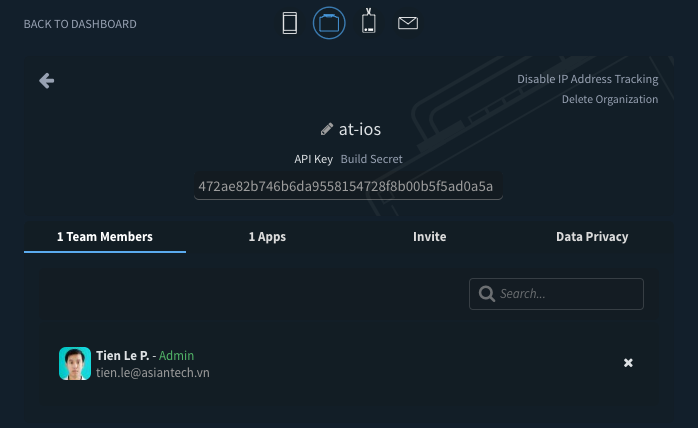
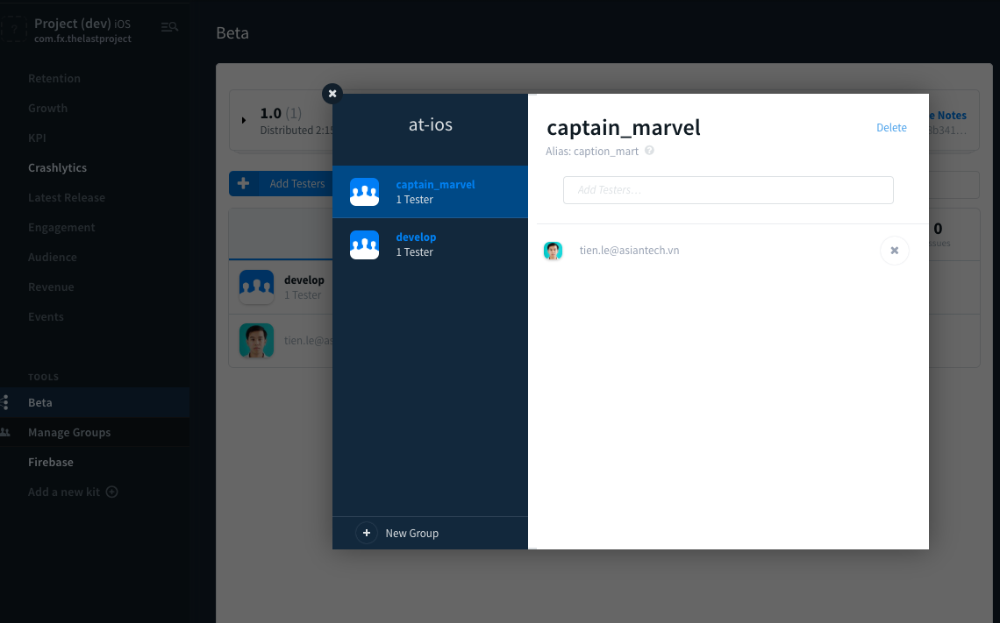
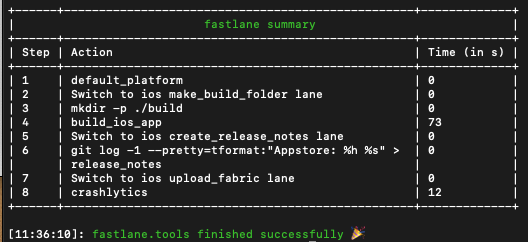
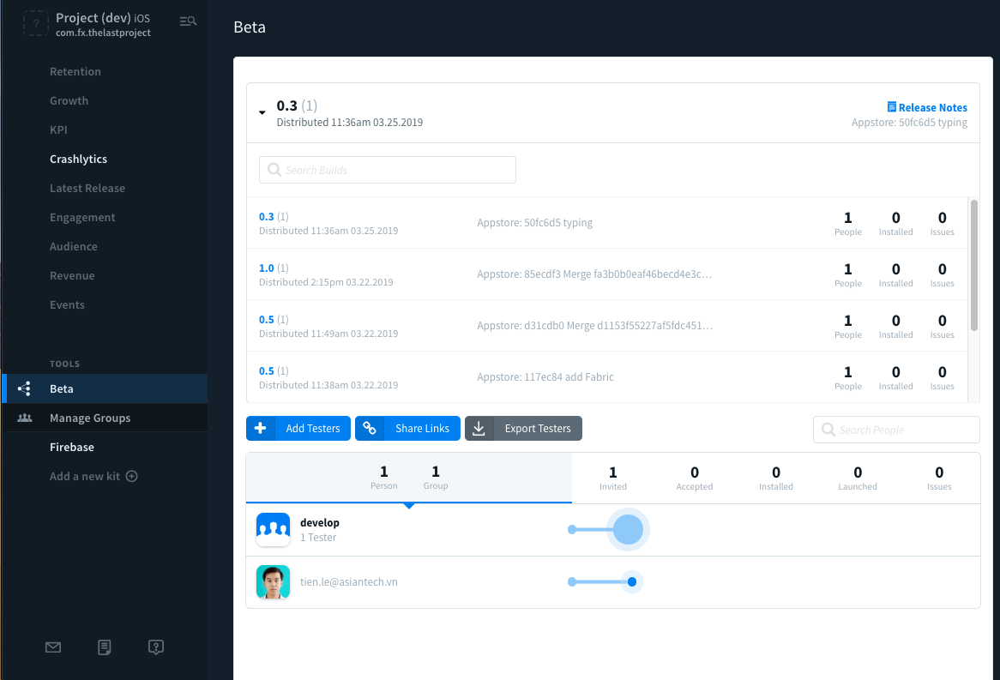
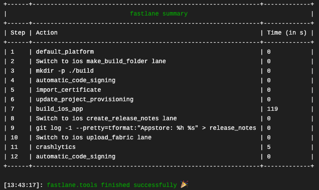

## <u>Phần 7:</u> Deploy App

Đây là một phần quan trọng mà bắt buộc bạn phải cấu hình. Vì nhiều nguyên nhân khách quan lẫn chủ quan nên bạn phải deploy được ứng dụng lên các dịch vụ như Testflight, DeployGate, Fabric … để tester và Khách hàng có thể tải được app về để test. 

​	Trong phần này mình chỉ đề cập tới dịch vụ ***Fabric*** thôi. Các dịch vụ khác để sau hoặc các bạn tự tìm hiểu, nó cũng ko quá phức tạp lắm.

#### 7.1. Fabric là gì?

​	**Fabric** là một thư viện Python mạnh mẽ cho phép bạn thực hiện các công việc deploy cũng như các tác vụ admin môi trường phát triển đến các server production. Nói một cách cụ thể thì Fabric cho phép chúng ta:

- Chạy một hàm Python bất kỳ từ command line
- Cho phép ta chạy các lệnh shell thông qua SSH một các dễ dàng và mang hơi hướng của Python (Pythonic) Về cơ bản, mọi người dùng đều sử dụng Fabric như là một công cụ để tự động hoá các công việc hàng ngày.

#### 7.2. Cài đặt Fabric

- Đăng ký account

  - Truy cập vào trang chủ: [https://www.fabric.io](https://www.fabric.io/)

  

  - Tải app của nó về máy tính và tiến hành đăng nhập vào:

  

  - Tiến hành lựa chọn project (Fabric tự động quét máy tính bạn và show ra các project đang làm)

  

  - Tiếp tục làm theo hướng dẫn, nó rất là dễ. Chung quy lại có 3 cái lớn cần làm

    - Thêm vào PodFile 2 thư viện: `Fabric` và `Crash

    ```ruby
    pod 'Fabric'
    pod 'Crashlytics'
    ```

    - Add a Run Script Build Phase (xem trên trang hướng dẫn)
    - Add Your API Key (xem trên trang hướng dẫn)
    - Init Your Kit (xem trên trang hướng dẫn)

  - Trang hướng dẫn : <https://fabric.io/kits/ios/crashlytics/install>

- Tiến hành build bản đầu tiên sau khi đã config và cài đặt xong tất cả. 

  - Khi build thì cần tạo **Organizations** trước để phân biệt các dự án với nhau

- Bạn truy cập vào lại account Fabric trên web thì sẽ thấy bản build của bạn và cần lấy thông tin sau

  - `API Key`
  - `Build Secret`



- Tiếp tục với việc edit `DASH BOARD` của app

  - Chọn `Beta` > `Manage Group` > tiến hành thêm group, thêm người, edit gì đó...

  

  

  Tới đây thì bạn đã oke cho việc setup `Fabric` rồi.

#### 7.3. Build & Upload ở Local

- Mở file `Fastfile` và tiến hành thêm các đoạn `lane` sau:
  - Các KEY thì bạn sử dụng key cá nhân của mình đã tạo ở trên

```bash
desc "Upload Fabric"
  private_lane :upload_fabric do |options|
    crashlytics(
      api_token: "YOUR_API_KEY",
      build_secret: "YOUR_BUILD_SECRET",
      notes_path: "./fastlane/release_notes.txt",
      groups: ["#{options[:groups]}"]
    )
  end
```

- Tạo release note cho bản build

```bash
desc "Create release notes"
    private_lane :create_release_notes do |options|
    sh "git log -1 --pretty=tformat:\"#{options[:format]}\" > release_notes.txt"
  end
```

- Edit `lane` để khi build xong thì `Fastlane` tiếp tục upload lên `Fabric`
  - Khi đẩy bản build lên Fabric bằng local thì với mạng sẽ rất chập chờn và có khi fail
  - Bạn cần chỉ định đúng `group` để bản build gởi tới được.

```bash
desc "Build App Local"
  lane :build_local do
    make_build_folder
    build_ios_app(
      scheme: "TheLastProject_Development", 
      workspace: "TheLastProject.xcworkspace",
      configuration: "Debug", 
      export_method: "development",
      output_directory: "./build",
      output_name: "TheLastProject_Dev.ipa",
      silent: true,
      clean: true
    )
    create_release_notes(format: 'Appstore: %h %s')
    upload_fabric(groups: "develop")
  end
```

- Mở `Terminal` lên và chạy lệnh build ở local để tận hưởng

```bash
bundle exec fastlane build_local
```

- Build và Upload thành công thì như sau



- Sau khi đã test thành công ở Local thì bạn có thể kiểm tra trên trang `DASH BOARD` fabric của bạn để xem bản build đã lên thành công thiệt hay không



#### 7.4. Build & Upload ở CI

- Khi đã ổn với Local thì tiến tới mục tiêu lớn là trên máy CI. Bạn edit lại đoạn `lane` build app cho CI

```bash
desc "Build App"
  lane :build do
    make_build_folder
    disable_automatic_code_signing(
      path: "TheLastProject.xcodeproj"
    )
    import_certificate(
      keychain_name: "ios-build.keychain",
      keychain_password: "travis",
      certificate_path: "./scripts/certs/dev.p12",
      certificate_password: "12345678"
    )
    update_project_provisioning(
      xcodeproj: "TheLastProject.xcodeproj",
      profile: "./scripts/profiles/TheLastProject_Dev.mobileprovision",
      target_filter: "TheLastProject",
      build_configuration: "Debug",
    )
    build_ios_app(
      scheme: "TheLastProject_Development", 
      workspace: "TheLastProject.xcworkspace",
      configuration: "Debug", 
      export_method: "development",
      output_directory: "./build",
      silent: true,
      clean: true,
      skip_profile_detection: true,
      export_options: {
        provisioningProfiles: { "com.fx.thelastproject": "TheLastProject_Dev" }
      }
    )
    create_release_notes(format: 'Appstore: %h %s')
    upload_fabric(groups: "batman")
    enable_automatic_code_signing(
      path: "TheLastProject.xcodeproj"
    )
  end
```

- Sau đó tiến hành commit lên và chờ đợi CI chạy để xem kết quả report có đúng như mong đợi hay không.

- Bảo mật các KEY của mình

  - Vào setting trong Travis CI tạo các biến môi trường (Environment Variables) để lưu trữ và bảo mật

  - Edit lại các đoạn code mà sử dụng các key đó.

    - Ví dụ: Biến tên là `TEN_BIEN` thì trong file `Fastfile` muốn sử dụng thì cú pháp như sau:

    ```
    ENV["TEN_BIEN"]
    ```

  - Edit lại đoạn `lane` upload với 2 biến môi trường vừa được tạo

  ```bash
  desc "Upload Fabric"
    private_lane :upload_fabric do |options|
      crashlytics(
        api_token: ENV["FABRIC_API_KEY"],
        build_secret: ENV["FABRIC_BUILD_SECRET"],
        notes_path: "./fastlane/release_notes.txt",
        groups: ["#{options[:groups]}"]
      )
    end
  ```

  


​	