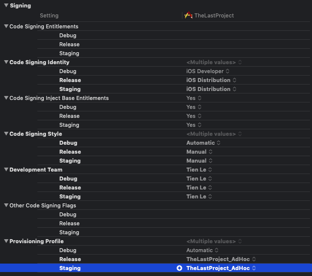
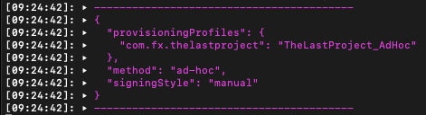

## Phần 8: Trigger build

Mọi thứ đã hoạt động một cách trơn tru rồi nhưng để thực sự thông minh hơn và tiện lợi hơn thì máy CI sẽ tự động build đúng theo cấu hình tương ứng với với những cài đặt của mình. Và đây cũng làm phần cuối trong seri mệt mỏi này. Ahihi

#### 8.1. Yêu cầu

```
a) khi merge 1 PR vào nhánh develop thì build `môi trường dev` gởi QCs 1 bản thông qua fabric
b) khi merge develop vào master thì tự động build `môi trường stag` gởi PMs
c) khi tạo branch `release/*` (ví dụ release/build) thì sẽ tự động build 1 bản production file ipa để đó, ko up lên đâu hết.
(Các nhóm QCs, Pms được tạo trong Fabric)
```

- **Phân tích yêu cầu**
  - Cần 3 bản build với 3 cấu hình khác nhau
    - Dev
    - Staging
    - Product
  - Theo dõi các hoạt động của GitHub bằng CI
    - Pull Request
    - Commit
    - Push Branch
  - Phân tích xác định đc các tên Branch
    - master cho Staging
    - develop cho Dev
    - release/* cho Product
- **Các công việc chúng ta cần làm**
  - Cấu hình lại `project` và `lane` để build được theo các config (đã tạo ở phần 1)
    - Dev
    - Staging
    - Release 
  - Bắt đc các `trigger` của Travis CI để chon lên build `fastlane` tương ứng
  - Code xử lý các trigger đó

#### 8.2. Cấu hình project và fastlane

- Về project trong Xcode thì bạn cần tuỳ chỉnh lại các cấu hình
  - **Develop** : auto siging để build
  - **Staging** : thì build manual, Xcode sẽ tự chọn cấu hình tương ứng trong Certificate và Provisioning
  - **Release** : tương tự như Staging
- Với phần 1 thì mình mới chỉ hướng dẫn mỗi 1 việc tạo các file Config để cấu hình chứa chưa đi vào hướng dẫn cấu hình từng cái như thế nào. Sau đây là cấu hình đề nghị cho mọi người có thể dễ làm theo.



- **Giải thích**

  - **Debug** thì sẽ là auto theo iOS Developer, certificate và provisioning sẽ tự nhận theo config trong Xcode
  - **Staging** thì sẽ là manual cho iOS Distribution, chỉ định rõ provisioning AdHoc. Còn certificatie sẽ được import từ ngoài vào máy MAC OS
    - Trên máy local là kích bằng tay và nó sẽ vào Keychain
    - Trên máy Travis thì mình dùng lệnh để import vào máy thông qua Keychain tự tạo
  - **Release** thì tương tư Staging, hoặc có thể cấu hình khác một chút nếu khách hàng muốn build cho AppStore...

- **Fastlane**

  - Trước tiên chúng ta cần test lại các cấu hình ở local để xem fastlane hoạt đồng hiệu quả hay không.
  - **Chú ý:**
    - scheme
    - configuration
    - export_method (tham khảo sau)
      - app-store
      - ad-hoc
      - package
      - enterprise
      - development
      -  developer-id

  ```bash
  desc "Build App AdHoc Local"
    lane :build_adhoc_local do
      make_build_folder
      build_ios_app(
        scheme: "TheLastProject_Staging", 
        workspace: "TheLastProject.xcworkspace",
        configuration: "Staging", 
        export_method: "ad-hoc",
        output_directory: "./build",
        output_name: "TheLastProject_Staging.ipa",
        silent: true,
        clean: true
      )
    end
  ```

  ​	Tiến hành build chạy trên local và tận hưởng kết quả. Nếu gặp lỗi thì bạn hãy bình tỉnh và xem lại các config trong Xcode và edit lại cho đúng

  ```bash
  bundle exec fastlane build_adhoc_local
  ```

  ​	Cần chú ý là bạn phải import các cetificate (development & distribution) vào máy trước đã. Nếu Terminal chạy ra như thế này thì fastlane đã chọn đúng cấu hình

  

- Áp dụng cho các confign còn lại

- Fastlane cho build trên máy CI, tham khảo 2 đoạn code sau và chú ý các config để sao cho đúng

  - **Build Staging**

  ```bash
  desc "Build Staging"
    lane :build_staging do
      make_build_folder
      disable_automatic_code_signing(
        path: "TheLastProject.xcodeproj"
      )
      import_certificate(
        keychain_name: "ios-build.keychain",
        keychain_password: ENV["KEYCHAIN_PASS"],
        certificate_path: "./scripts/certs/dis.p12",
        certificate_password: ENV["CERT_PASS"]
      )
      update_project_provisioning(
        xcodeproj: "TheLastProject.xcodeproj",
        profile: "./scripts/profiles/TheLastProject_AdHoc.mobileprovision",
        target_filter: "TheLastProject",
        build_configuration: "Staging",
      )
      build_ios_app(
        scheme: "TheLastProject_Staging", 
        workspace: "TheLastProject.xcworkspace",
        configuration: "Staging", 
        export_method: "ad-hoc",
        output_directory: "./build",
        silent: true,
        clean: true,
        skip_profile_detection: true,
        export_options: {
          provisioningProfiles: { "com.fx.thelastproject": "TheLastProject_AdHoc" }
        }
      )
      create_release_notes(format: 'Appstore: %h %s')
      upload_fabric(groups: "staging")
      enable_automatic_code_signing(
        path: "TheLastProject.xcodeproj"
      )
    end
  
  
  ```

  - **Build Release**

  ```bash
  desc "Build Release"
    lane :build_release do
      make_build_folder
      disable_automatic_code_signing(
        path: "TheLastProject.xcodeproj"
      )
      import_certificate(
        keychain_name: "ios-build.keychain",
        keychain_password: ENV["KEYCHAIN_PASS"],
        certificate_path: "./scripts/certs/dis.p12",
        certificate_password: ENV["CERT_PASS"]
      )
      update_project_provisioning(
        xcodeproj: "TheLastProject.xcodeproj",
        profile: "./scripts/profiles/TheLastProject_AdHoc.mobileprovision",
        target_filter: "TheLastProject",
        build_configuration: "Release",
      )
      build_ios_app(
        scheme: "TheLastProject_Release", 
        workspace: "TheLastProject.xcworkspace",
        configuration: "Release", 
        export_method: "ad-hoc",
        output_directory: "./build",
        silent: true,
        clean: true,
        skip_profile_detection: true,
        export_options: {
          provisioningProfiles: { "com.fx.thelastproject": "TheLastProject_AdHoc" }
        }
      )
      create_release_notes(format: 'Appstore: %h %s')
      upload_fabric(groups: "release")
      enable_automatic_code_signing(
        path: "TheLastProject.xcodeproj"
      )
    end
  ```

  ​	***Tiếp tục test trên máy CI và nếu không được kết quả như mong muốn thì thay vì chống cự thì bạn nên tận hưởng nó. Ahihi***

#### 8.3 Trigger

​	Muốn cho máy CI có thể chọn đúng cấu hình để build thì chúng ta cần phải bắt đc và xử lý được các thông tin sau:

```
- Tên branch
- Kiểu tương tác
  - Commit
  - Push
  - Pull Request
  - Merge

```

Các thông tin đó thì Travis đã hỗ trợ bạn trong các biến môi trường (**environment-variables**) của nó. Đọc thêm tại đây (<https://docs-staging.travis-ci.com/user/environment-variables/#default-environment-variables>

)

- Kiểm tra các config trong setting của Travis đã oke chưa

  - Build pushed branches : on
  - Build pushed pull requests : on

- Thử với việc kiểm tra các pull request đúng với 2 branch

  - **develop** thì sẽ build cho môi trường *Dev*
  - **master** thì sẽ build cho môi trường *Staging*

  Mở file `.travis.yml` và edit đoạn script sau

```bash
script:
  - ./scripts/lint
  - if [[ "$TRAVIS_BRANCH" == "develop" ]]; then bundle exec fastlane build_dev; fi
```

​	Tạo branch `develop` commit code và tận hưởng cái kết.

- Đoạn script trên:
  - Sử dụng biến muôi trường
  - Vài dòng `if else` cơ bản
  - Bạn có thể sử dụng cho `master`
- Tuy nhiên, với việc build cho môi trường `Release` thì có yêu cầu là khi tạo 1 branch với tên là `release/*` thì Travis sẽ tự động chạy và build. Công việc chúng ta còn 2 việc
  - Lấy đúng tên `branch`
  - Xử lý chuỗi để biết là có chữ `release` hay không
  - Tham khảo : <https://stackoverflow.com/questions/2172352/in-bash-how-can-i-check-if-a-string-begins-with-some-value>
- bash cách bá hơn để lấy đc tên `branch` hiện tại.

```bash
script:
  - export BRANCH=$(if [ "$TRAVIS_PULL_REQUEST" == "false" ]; then echo $TRAVIS_BRANCH; else echo $TRAVIS_PULL_REQUEST_BRANCH; fi)
  - echo "TRAVIS_BRANCH=$TRAVIS_BRANCH, PR=$PR, BRANCH=$BRANCH"
```

- Sau khi đủ các điều kiện và biến thì bạn hãy viết 1 script riêng cho việc build app này. Đây là đoạn code tham khảo, mình tạo file shell bash với tên là `run`
  - Lấy được `current branch`
  - Xử lý đc chuỗi
  - Khuyên bạn là nên test đoạn script này ở local (xoá các dòng lệnh build, để lại lệnh echo)

```bash
#Log debug branch
BRANCH=$(if [ "$TRAVIS_PULL_REQUEST" == "false" ]; then echo $TRAVIS_BRANCH; else echo $TRAVIS_PULL_REQUEST_BRANCH; fi)
echo "TRAVIS_BRANCH=$TRAVIS_BRANCH, PR=$PR, BRANCH=$BRANCH"

if [ "$TRAVIS_BRANCH" == "develop" ]
then
  echo "********** BUILD DEV **********"
  bundle exec fastlane build_dev
elif [ "$TRAVIS_BRANCH" == "master" ]
then
  echo "********** BUILD STAGING **********"
  bundle exec fastlane build_staging
elif [[ "$TRAVIS_BRANCH" == "release"* ]]
then
  echo "********** BUILD RELEASE **********"
  bundle exec fastlane build_release
else
  echo "NOTHING"
fi
```

- Sau khi đã ok thì bạn commit code và tiến hành test theo các trường hợp mà yêu cầu đề ra
  - Tạo branch `develop` , tạo tiếp branch con từ nó, edit và gởi pull request
  - Merge `develop` về `master`
  - Tạo branch `release/*` từ `master`
- Bạn kiểm tra các bản build đã được upload lên Fabric hay chưa. Nếu còn lỗi thì hãy fix nó. Nếu oke hết thì chúc mừng bạn đã hoàn thành seri mệt mỏi này
- Phần tiếp theo mà bạn cần làm
  - Làm đẹp code
  - Build matrix
  - Config với các dịch vụ CI khác