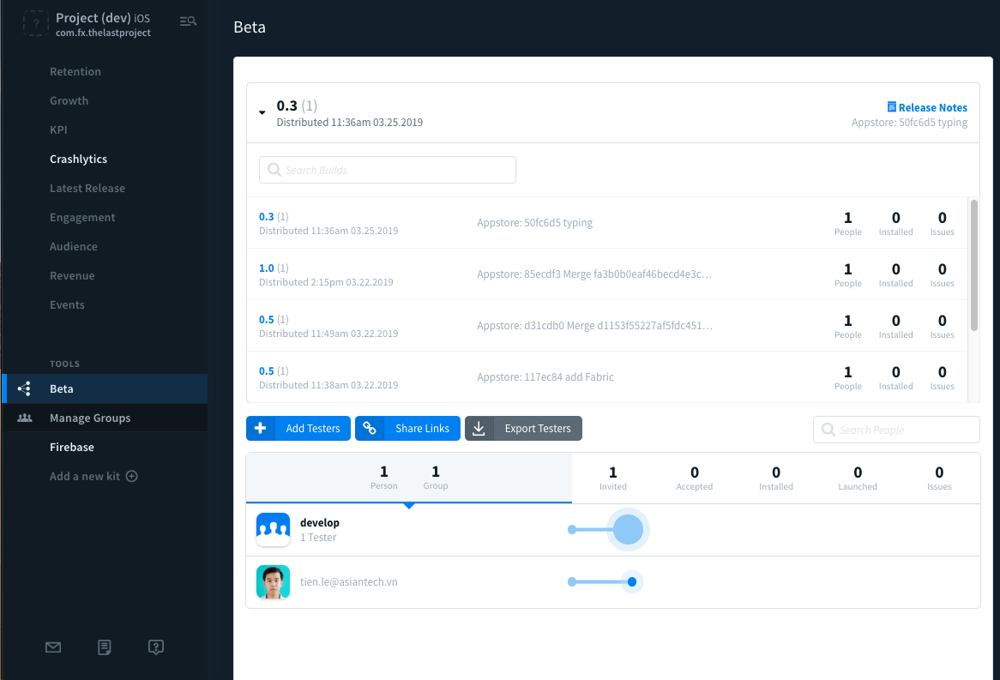
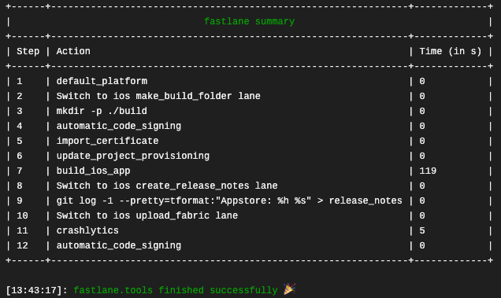

# Configuration Management CI/CD

**Mục lục:**

[1. Cài đặt bundle cho project](#1-cài-đặt-bundle-cho-project)

[2. Using Xcode Configuration (.xcconfig) to Manage Different Build Settings](#2-using-xcode-configuration-xcconfig-to-manage-different-build-settings)

[3. Basic config Travis CI](#3-basic-config-travis-cI)

[4. Auto Review Code and Report](#4-auto-review-code-and-report)

[5. Certificate và Provisioning profile](#5-certificate-và-provisioning-profile)

[6. Fastlane đại cương](#6-fastlane-đại-cương)

[7. Deploy app](#7-deploy-app)

[8. Trigger build](#8-trigger-build)

​	Ps: Bạn có thể vào thư mục `Documents` để xem từng phần riêng lẻ.

---


### 1. Cài đặt bundle cho project

Cài đặt `bundle` (nếu chưa có), mở Terminal lên và gõ

``` ruby
gem install bundle
```

Nếu chưa cài đặt luôn *gem* thì làm ơn lên Google tìm cách nha

* **Bước 1: init gemfile**

```ruby
bundle init
```

Nó sẽ tạo ra 1 file tên là `gemfile` . 

* **Bước 2: edit gemfile**

Dùng trình editor nào đó mà mở lên edit lại, ví dụ như sau:

```ruby
gem 'fastlane', '2.97.0'
gem 'xcpretty', '0.2.8'
gem 'cocoapods', '1.5.3'
gem 'linterbot', '0.2.7'
gem 'slather', '2.4.5'
```

* **Bước 3: install gem**

Sinh ra file `gemfile.lock` 

```ruby
bundle install
```

* **Bước 4: install cocoapod**

Bạn trước tiên sẽ edit và thêm `cocoapod` vào gemfile, sau đó chạy lệnh sau để tạo cocoapod

```ruby
bundle exec pod init
```

Tạo ra file `Podfile`. Qua lệnh trên bạn sẽ thấy để dùng `bundle` thực thi 1 thứ gì đó thì bạn cần có `exec` , sau đó là nhưng thứ gì bạn muốn thực hiện

* **Bước 4: edit Podfile**

Bạn mở file `Podfile` lên và thêm các thư viện mà bạn cần, như bao lần trước đây khi bạn làm với dự án.

* **Bước 5: install pod**

Tiếp tục sử dụng `bundler exce pod` để thực hiện các lệnh của `pod` thông qua `bundle` 

```ruby
bundle exce pod install
```

Lệnh này tương tự `pod install` nó sẽ tạo ra `Podfile.lock` và file `workspace` cho project của bạn.

#### Dùng đầu óc tưởng tượng thêm xí:

- CocoaPod là chỗ chứa các thư viện cho iOS: muốn sài thì phải:

   `init` --> edit *podfile* --> `pod install`

- Bundle thì là chỗ chứa các thứ trâu chó như là *cocoapod* và nó cũng làm tương tự như thế : 

  `init` --> edit gemfile --> `install` --> thêm 1 bữa nữa là muốn chạy gì thì gọi lệnh `exec` mà chạy

---


### 2. Using Xcode Configuration (.xcconfig) to Manage Different Build Settings

Đọc tham khảo tại đây : <https://www.appcoda.com/xcconfig-guide/>

#### 2.1 Creating the Build Configuration

* Thêm configuration cho project, thường sẽ là:

- - Debug
  - Staging
  - Release

* Việc này đơn giản là Duplicate 1 cái có sẵn trong Project

#### 2.2 Using Xcode Configuration File (.xcconfig)

* Về Xcode Configuration file (. xcconfig) chứa những cặp giá trị (key/value) dùng trong project

* New file (**.xcconfig**) —> tạo 3 file cho 3 môi trường —> set vào các config đã đc tạo ra

* Tiến hành edit hay thêm các cặp giá trị vào các file config. Chú ý tất cả các key phải đều đc có mặt ở tất cả các file config

*Ví dụ:*

​	**Debug:**

```swift
IS_APP_NAME = Project (dev)

IS_APP_VERSION = 0.3

IS_APP_BUNDLE_ID = com.fx.TheLastProject.Debug
```


​	**Staging**

```swift
IS_APP_NAME = Project (Staging)

IS_APP_VERSION = 0.2

IS_APP_BUNDLE_ID = com.fx.TheLastProject.Staging
```

​	**Release:**

```swift
IS_APP_NAME = The Last Project

IS_APP_VERSION = 0.1

IS_APP_BUNDLE_ID = com.fx.TheLastProject.Release
```

Mình có thể change cả icon (cái này để sau đi hì)

#### 2.3 Accessing Variables from Code

* Đây là phần cần quan tâm, vì chứa nhiều thứ quan trọng như: Key, Endpoint …

  **Debug.xcconfig:**

```swift
BACKEND_URL = http:\/\/api.intensifystudio.com/development

CONSUMER_KEY = ck_a57e4fa2e14c12ae3f400371cf2951ec3dea5_dev

CONSUMER_SECRET = cs_c847caa35ce1041e9c69d239141f13f63bb22b_dev
```

​	**Staging.xcconfig:**

```swift
BACKEND_URL = http:\/\/api.intensifystudio.com/staging

CONSUMER_KEY = ck_a57e4fa2e14c12f400371cf2951ec3dea5_staging

CONSUMER_SECRET = cs_c847caa35ce1041e9c69d239141f13f63bb22b_staging
```

​	**Release.xcconfig:**

```swift
BACKEND_URL = http:\/\/api.intensifystudio.com/

CONSUMER_KEY = ck_a57e4fa2e14c12f400371cf2951ec3dea5

CONSUMER_SECRET = cs_c847caa35ce1041e9c69d239141f1f63bb22b
```

XONG —> vào file Info.plist mà thêm chúng vào (add row)

Lấy giá trị từ file *Info.plist* vào trong code như sau:

```swift
func infoForKey(_ key: String) -> String? {
        return (Bundle.main.infoDictionary?[key] as? String)?
            .replacingOccurrences(of: "\\", with: "")
 }
```

#### 2.4  Switching Between Build Configurations

Vào scheme -> Edit scheme -> Run -> Build Config : mà thay đổi

---


### 3. Basic config Travis CI

Phần này dành cho các bạn mù về CI, nếu bạn đã trùm thì có thể bỏ qua phần này. Ahihi. Trước tiên thì đi vào mấy khái niệm cơ bản trước đã:

* **CI là gì?**
  - Viết tắt của ***Continuous Integration (CI)*** ; gọi là tích hợp liên tục
  - Giúp cho mình trong việc kiểm tra, build app, test (UI và Unit), review code giúp
  - Tích hợp vào GitHub để thông báo cho dev biết tình trạng các pull request của mình
  - Về iOS thì CI khá đắt do giá máy MAC OS trên các dịch vụ CI tốn phí nhiều. 
* **Travis CI**
  * Là dịch vụ CI cho lập trình viên
  * Tích hợp đc với Github
  * Có 2 phiên bản
    * Free (chỉ chạy đc public repo) : <https://travis-ci.org/>
    * Trả phí (chạy đc private repo) : <https://travis-ci.com/>

#### 3.1 The YAML File

- Là file có đuôi là `yml` 

- Các dịch vụ CI sẽ tự động clone source code từ repo của bạn về, nếu trong repo có `yaml file` thì sẽ tự động đọc file đó và thực thi các lệnh hay setup cấu hình mà mình ghi trong đó.

- Với Travis CI thì file sẽ tên là `.travis.yml`

  Ví dụ:

  ```ruby
  language: objective-c
  osx_image: xcode10.1
  xcode_workspace: TheLastProject.xcworkspace
  xcode_scheme: TheLastProject_Development
  xcode_destination: platform=iOS Simulator,OS=12.1,name=iPhone X
  before_install:
    - bundle install
    - bundle exec pod install --repo-update
  ```

#### 3.2 Cấu trúc cơ bản của YAML File

* **language**

  * Travis hỗ trợ cả 2 ngôn ngữ `Objective-C` và `Swift`
  * Tuy nhiên cài đặt thì `objective-c` cho cả 2

* **osx_image**

  * Đây là máy ảo chọn để build project lên mình
  * Có nhiều cấu hình máy áo, bạn nên chọn loại phù hợp với project của mình. Nếu như chọn máy ảo đời thấp hơn so với yêu cầu project thì sẽ ko build đc
  * Danh sách các máy ảo đc support của Tracis CI sau [đây](https://docs.travis-ci.com/user/reference/osx/)

* **xcode_workspace**

  * Vì có nhiều project trong 1 workspace (Pod, project hiện tại, các thư viện nếu build trực tiếp từ project)
  * Nên hãy chọn cho đúng
  * Nếu có thư mục thì hãy trỏ đường dẫn vào. Ví dụ:

  ```ruby
  ./Example/TravisCIBlog.xcworkspace
  ```

* **xcode_scheme**

  * Cực kì quan trọng vì nó sẽ quyết định bạn muốn build gì hay kiểm tra gì. Hãy chọn cho đúng.
  * Ngoài ra, thì cần phải ***share*** scheme để CI có thể build đc (vào Scheme -> Managment —> xem vào chọn)

* **xcode_destination**

  * Lựa chọn cho các thanh niên nhà nghèo khi dùng `iPhone simulator`
  * Bạn có thể quyết định chọn máy ảo nào để build
  * Danh sách các máy ảo được support ở [đây](https://gist.github.com/jgsamudio/4a38d468c12aaec84cdc5f5b2c77b726)

* **before_install**

  * Cực kì quan trọng, vì nó sẽ chạy các lệnh cơ bản trước khi thực hiện
  * Vì máy ảo đó trên mạng nên ko có như local là bạn chỉ cần chạy các lệnh như `pod` rồi cứ thế mà build tới. Nên mình phải thêm các lệnh đó vào phần này

  ```ruby
  before_install:
    - bundle install
    - bundle exec pod install --repo-update
  ```

  * Nếu có lệnh nào phức tạp hơn thì hay chuẩn bị gì thêm thì bỏ thêm vào

#### 3.3 Triggering a Build

* Phần này thì mặc định Tracis CI sẽ theo dõi các `pull request` vào `master`
* Nên bạn cứ tạo `new branch` và gởi `pull request` . Các lần sau chỉ cần `commit` và `push` vào `branch` đó thì CI auto chạy
* Vì sài đồ free hoặc nếu có trả phí thì cũng sẽ bị giới hạn các repo build cùng lúc nêu

```
Chờ đợi là hạnh phúc. Ahihi
```

* Các trigger phức tạp thì sẽ để phần sau nha. :-)

#### 3.4 Cấu hình lại Project

* Đời không đơn giản khi bạn cấu hình xong `yaml file` là CI sẽ chạy. Lỗi đầu tiên gặp như sau:

```
The command "set -o pipefail && xcodebuild -workspace TheLastProject.xcworkspace -scheme TheLastProject_Development build test | xcpretty" exited with 66
```

* Bạn nên xem lại project đã có các target `test` chưa, nếu chưa có thì:
  * Tạo thêm các target test (Unit & UI)
  * Config build cho tụi nó
  * Check lại 1 lượt các scheme
* Tiếp theo lỗi như thế này

```
error: No profiles for 'com.fx.TheLastProject' were found: Xcode couldn't find any iOS App Development provisioning profiles matching 'com.fx.TheLastProject'. Automatic signing is disabled and unable to generate a profile. To enable automatic signing, pass -allowProvisioningUpdates to xcodebuild. (in target 'TheLastProject')
```

* Chúc mừng là đã thiếu profile `dev, certificate, provisioning profile` … Nôm na là phần `dev signing` để có thể build đc app. Khắc phục sau:
  * Cần phải tắt auto signing
  * Nếu tắt rồi mà không đc thì xoá `team developer`
  * Nếu như vậy mà không đc nữa thì chú ý phần **xcode_destination**, cấu hình lại cho `simulator` chạy. Vì đôi khi một số xcode của anh/chị/em đã ăn với account dev nào rồi nên pó tay thôi.

```
Đừng lo lắng về phần này quá. Vì sẽ được giải quyết tiếp ở phần sau. Ahuhu
```

#### 3.5 Làm đẹp YAML

* **cache** : vì các lệnh `bundler` và `pod` chạy khá tốn thời gian, nên mình sẽ cache lại phần này. Có thể chọn đường dẫn để trỏ tới thư mục cache

```ruby
cache:
  - bundler
  - cocoapods
```

* **script**: dùng để chạy các tập lệnh phức tạp hơn chút
* **install**: thêm các tiện ích khác.

Tạm thời như vậy, sau đây là `yaml file` cơ bản của mình. Ahihi

```ruby
language: objective-c
osx_image: xcode10.1
cache:
  - bundler
  - cocoapods
xcode_workspace: TheLastProject.xcworkspace
xcode_scheme: TheLastProject_Development
xcode_destination: platform=iOS Simulator,OS=12.1,name=iPhone X
before_install:
  - bundle install
  - bundle exec pod install --repo-update
install:
  - set -o pipefail
  - sudo systemsetup -settimezone Asia/Ho_Chi_Minh
  - bundle install --path=vendor/bundle --jobs 4 --retry 3
```

**WELL DONE!**

---


### 4. Auto Review Code and Report

#### 4.1 Sử dụng SwiftLint

* **Khái niệm:**
  * SwiftLint: 
    * Là một **tool** dùng để kiểm tra code (hay gọi là *review code*) theo **conventions** của Swift
    * Có thể bắt gặp nhiều *Lint* khác cho nhiều loại ngôn ngữ khác
    * Về conventions thì mình có thể sử dụng các `rule` mặc định hoặc có thể tự `custom` theo conventions của team hay của dự án
    * Link: <https://github.com/realm/SwiftLint>
* **Cài đặt** dùng `CocoaPod`

```ruby
pod 'SwiftLint'
```

* Thêm script vào Xcode để chạy `swiftlint`

  * Vào `Build Phases` > `New Run Script Phase` 
  * Đoạn script như sau:

  ```ruby
  "${PODS_ROOT}/SwiftLint/swiftlint"
  ```

  Xem hình dưới đây cho rõ


​	Build project và sẽ thấy `Swiftlint` thông báo các `warning` và `error`

#### 4.2 Sử dụng SwiftLint với CI

* Để sử dụng được `SwiftLint` với CI hay ở đây là `Travis CI` thì:
  * Tạo 1 `yaml file` và đặt ở thư mục gốc. CI sẽ tự động quét và chạy
  * Đặt tên sau `.swiftlint.yml`
* Nội dung file tham khảo

```ruby
disabled_rules: # rule identifiers to exclude from running
  - colon
  - comma
  - control_statement
opt_in_rules: # some rules are only opt-in
  - empty_count
  # Find all the available rules by running:
  # swiftlint rules
excluded: # paths to ignore during linting. Takes precedence over `included`.
  - Carthage
  - Pods
  - vendor
analyzer_rules: # Rules run by `swiftlint analyze` (experimental)
  - explicit_self

# configurable rules can be customized from this configuration file
# binary rules can set their severity level
force_cast: warning # implicitly
force_try:
  severity: warning # explicitly
# rules that have both warning and error levels, can set just the warning level
# implicitly
line_length: 110
# they can set both implicitly with an array
type_body_length:
  - 300 # warning
  - 400 # error
# or they can set both explicitly
file_length:
  warning: 500
  error: 1200
# naming rules can set warnings/errors for min_length and max_length
# additionally they can set excluded names
type_name:
  min_length: 4 # only warning
  max_length: # warning and error
    warning: 40
    error: 50
  excluded: iPhone # excluded via string
identifier_name:
  min_length: # only min_length
    error: 3 # only error
  excluded: # excluded via string array
    - id
    - URL
    - GlobalAPIKey
reporter: "xcode" # reporter type (xcode, json, csv, checkstyle, junit, html, emoji, sonarqube, markdown)
```

* Ý nghĩa các từ khoá và lệnh trong file trên thì các bạn từ tìm hiểu và nói chung thì cũng không khó mấy, nên vọc vọc tí là ra
* **Chú ý:**
  * Rule : các luật (rule) cho conventions
  * Thư mục và đường dẫn : nếu bạn có sử dụng thì hãy check, vì ghi thư mục trong file nhưng nó ko có trong repo thì không `pass` đc CI
* Các trường hợp chạy `SwiftLint` oke thì bản build sẽ được kiểm tra, nếu bản build `failed` thì sẽ báo như sau:

```
Testing failed:
	Identifier Name Violation: Variable name should be between 4 and 40 characters long: 'key' (identifier_name)
	Testing cancelled because the build failed.
** TEST FAILED **
```

​	Còn đúng thì âm thầm không show ra gì, nên cứ bình tĩnh mà tiến tới tiếp bước sau, ahihi

#### 4.3 Report/Comment lên GitHub

​	Để có thể post/comment các kết quả của `SwiftLint` lên GitHub thì chúng ta sử dụng `LinterBot`

* **Khái niệm**

  * **Linterbot**
    *  Là 1 con `BOT` , nhiệm vụ của nó là đọc `out put` của `SwiftLint` và comment vào `pull request` trên GitHub
    * Cần có được `access_token` từ account của dev mới có thể post comment vào
  * Link tham khảo: https://github.com/guidomb/linterbot

* **Cài đặt:**

  * Thêm vào `GemFile`

  ```ruby
  gem 'linterbot'
  ```

  * Install

  ```ruby
  gem install linterbot
  ```

* **Sử dụng ở Local**

  ```ruby
  swiftlint lint --reporter json | linterbot REPOSITORY PULL_REQUEST_NUMBER
  ```

* **Sử dụng với Travis CI**

  * Create **bash** script (bash là gì thì tự tìm hiểu nha)

    * Tạo thư mục `bin` (trong thư mục gốc) > tạo 1 file (**ko có đuôi**) và edit như sau:

    ```bash
    #!/bin/bash
    
    if [ "$TRAVIS_PULL_REQUEST" != "false" ]
    then
      ./Pods/SwiftLint/swiftlint --reporter json > swiftlint-report.json || false
      linterbot $TRAVIS_REPO_SLUG $TRAVIS_PULL_REQUEST < swiftlint-report.json
    fi
    ```

    * Chú ý đường dẫn sau `./Pods/SwiftLint/swiftlint` Vì đó là nơi mà mình `pod` swiftlint về nên trỏ vào đúng nó mới chạy đc. Lỗi ngu ngu này mất cả tiếng đồng hồ nếu copy dán không suy nghĩ.
    * Saved file lại với tên là `linter`
    * Edit quyền để tránh các lỗi về `Permission denied` như sau (khi chạy trên CI)

    ```
    0.01s$ ./bin/linter
    /Users/travis/.travis/functions: line 104: ./bin/linter: Permission denied
    The command “./bin/linter” exited with 126.
    ```

    * Lệnh set lại quyền truy cập như sau (dành cho các thanh niên không biết)

    ```bash
     chmod +x ./bin/linter
    ```

  * Edit `.travis.yml`

    * Thêm các lệnh cài đặt `linterbot` 

    ```ruby
    before_install:
      - bundle install
      - gem install linterbot
      - bundle exec pod install --repo-update
    ```

    * Thêm lệnh thực hiện `script` linter

    ```ruby
    script:
      - ./bin/linter
    ```

  * File `.travis.yml` đẹp như sau:

  ```ruby
  language: objective-c
  osx_image: xcode10.1
  cache:
    - bundler
    - cocoapods
  xcode_workspace: TheLastProject.xcworkspace
  xcode_scheme: TheLastProject_Development
  xcode_destination: platform=iOS Simulator,OS=12.1,name=iPhone X
  before_install:
    - bundle install
    - gem install linterbot
    - bundle exec pod install --repo-update
  install:
    - set -o pipefail
    - sudo systemsetup -settimezone Asia/Ho_Chi_Minh
    - bundle install --path=vendor/bundle --jobs 4 --retry 3
  script:
    - ./bin/linter
  ```

* **access_key**

  * Để có thể `post/comment` lên được GitHub thì cần có quyền truy cập từ GitHub
  * Tham khảo cách tạo `access_key` :  <https://help.github.com/en/articles/creating-a-personal-access-token-for-the-command-line>
  * Để đảm bảo tính **bảo mật** thì các `key` sẽ được lưu trữ trên trang `Travis CI`.  Vào setting > tạo 1 `GITHUB_ACCESS_TOKEN`

  

#### 4.4 Kết quả

* Tiến hành commit và gởi pull request để CI chạy và kiểm tra. Nếu đầy đủ các kết quả sau trên `pull request` thì chúc mừng bạn đã pass qua bước này, ahihi
  * Pass đc CI
  * Xuất hiện Comments của `SwiftLint` thông qua `linterbot` 


---

> Thiêu đốt thân tàn ta
>  Lửa thánh cháy bừng bừng,
>  Sống chẳng có gì vui,
>  Thì chết có gì khổ?
>
> Nguyện hành thiện trừ ác.
>  Làm sao cho Quang Minh
>  Bao hỉ lạc bi sầu,
>  Đều hóa thành cát bụi.
>
> Thương thay cho con người,
>  Sao lo buồn lắm vậy?
>  Thương thay cho con người,
>  Sao lo buồn lắm vậy? !
>
> ​	**(Thánh ca Minh Giáo - Ỷ Thiên Đồ Long Ký - Kim Dung)**

---

Chúc mừng bạn đã tới được đây thì đã hoàn thành 1 nữa con đường cho CI (auto build, review code và report lên GitHub). Với các dự án không yêu cầu gì đặc biệt thì như vậy cũng đã ổn rồi. Bạn có thể xông pha ra giang hồ giết quái.

Còn muốn úp level tiếp thì mời bạn tiếp tục phần còn lại là **CD**. Bạn đi pha cốc trà/cafe ăn miếng bánh rồi bình tĩnh làm từng xí 1. Phần này cực kì nỗ não à. Ahihi

---

### 5. Certificate và Provisioning profile

Muốn có được tụi này thì bạn phải bỏ tiền là mua account **Apple Developer Program**, với giá là 99$/năm. Khá chua cho cuộc tình nhưng theo lời khuyên chân thành thì cứ nên đầu tư 1 cái, vì mình còn có nhiều thứ làm với account đó nữa. 

Xin cảm ơn **Viblo** vì đã giải thích quá rõ : <https://viblo.asia/p/khai-quat-ve-apple-developer-account-certificates-provioning-profiles-RQqKLgap57z>

#### 5.1. Certificates

* Sau khi đã join vào Membership Program của Apple, điều bạn cần quan tâm đến là Certificates, App IDs và Provisioning Profiles. Certificate có thể coi là chứng minh nhân dân hoặc bằng lái xe của bạn vậy. 
* Bạn cần request, download và sử dụng các signing certificate để xác thực, chứng nhận bạn có quyền phát triển và phát hành ứng dụng với tài khoản Apple developer tương ứng. 
* Certificate được quản lý dưới dạng 
  * public key 
  * private key. 

* Khi muốn share certificate, bạn cần export certificate (private key) dưới dạng file **.p12**. Nếu làm mất private key, bạn phải tạo lại certificate khác từ đầu. 
* Có 2 loại certificate cần chú ý. Đó là:
  * **Development Certificates**  : Là những certificate dành cho giai đoạn phát triển ứng dụng. Gồm 2 loại chính:
    * **iOS App Development**: Development Certificate được dùng trong quá trình develop app. Giúp developer có thể run và debug app trong môi trường development. Thường thì mỗi thành viên trong team phát triển sẽ cần tạo một certificate loại này để chứng nhận quyền develop app. Mỗi member được tạo tối đa 4 certificate development.
    * **Apple Push Notification service SSL (Sandbox)**: dùng cho server push notification ở môi trường development cho một App ID cụ thể. Ví dụ bạn cần push notification về một app có App ID là com.xxx.yyy thì server push cần được cấp quyền push. Quyền push được thể hiện qua certificate dạng này.
  * Production Certificates : Là những certificate dùng để phát hành ứng dụng. Có nhiều loại, nhưng thường thì ta chỉ cần quan tâm đến 3 loại:
    * **App Store and Ad Hoc**: Certificate loại này cho phép bạn có quyền distribute app lên App Store hoặc trên một list các thiết bị có sẵn trong tài khoản dạng Ad Hoc.
    * **Apple Push Notification service SSL (Production)**: Tương tự như **Apple Push Notification service SSL (Sandbox)**, certificate này cấp quyền cho server push notification đến app trong môi trường production.
    * **In-House and Ad Hoc**: Certificate này chỉ xuất hiện với tài khoản enterprise, cho phép phát hành app dạng Ad Hoc hoặc In-House (không giới hạn số lượng thiết bị, không cần biết trước UUID...).


#### 5.2. App IDs, Device and Provisioning Profile

* **App IDs** : là định danh các ứng dụng thông mà 1 chuỗi ký tự để đảm bảo là duy nhất mà giang hồ hay gọi là bundle id
* **Devices**: các thiết bị được thêm vào với mã UUID của nó vào account dev. Có như vậy thì bạn mới có thể cài đc app lên thiết bị của bạn với app build ở môi trường distribution.
* **Provisioning Profile:**
  * Một cách ngắn gọn để giải thích về provisioning profile là công thức sau: 
    * **Provisioning Profile = Certificate (Development hoặc Production) + App ID + Devices List (nếu distribute dạng Ad Hoc hoặc debug development).** 
  * Provisioning Profile có thể được tạo ra tự động nếu bạn enable option **Auto Signing** trên Xcode hoặc có thể được tạo và quản lý bởi các tài khoản admin trở lên. 
  * Để tạo provisioning profile cho một app ở môi trường development, bạn cần chọn App ID, chọn các Certificate được join vào, chọn list devices. 
  * Một trong các thành phần của provisioning profile bị invalid thì profile đó sẽ **invalid** và không sử dụng được. 
    * *Ví dụ* một team member *revoke development certificate* của người đó thì tất cả các provisioning profile chứa certificate đó sẽ bị invalid. Hoặc khi xóa một App ID thì tất cả các provisioning profile liên quan cũng sẽ bị xóa theo


#### 5.3. Thêm các file Certificates và Provisioning vào CI

Bạn cần hiểu nôm na là CI sẽ chạy 1 con máy MAC OS trên server và con máy đó không có gì hết, công việc của mình là sẽ thêm bằng tay tất cả những thứ cần cho việc build vào con CI đó.

* **Chuẩn bị các file:**

  * Tạo 1 app id với bundle id của project của bạn
  * 2 file certificates cho 2 môi trường Development và Distribution
    * Public key là các file .cer
    * Private key là các file .p12 (tụi nó có pass)
  * 2 file provisioning cho 2 môi trường đó

  Các bạn có thể sử dụng các file của mình trong repo này, tuy nhiên sau này nếu không chạy đc thì do mình đã xoá trên account dev của mình. Vì vậy tốt nhất là nên sài đồ của bản thân cho chắc.


* **Cấu hình lại project** của các bạn để có thể build và test đc project bằng Xcode với 2 kiểu sau:

  * Auto signing
  * Dùng Provisioning và Certificate

* **Coding**

  * Di chuyển script `linter` vào thư mục `./script` để tiện quản lý
  * Viết scripts để thêm các file trên vào máy ảo Travis CI. Bạn tạo 1 shell bash tên là `add-key.sh` trong thư mục `./scripts`

  ```bash
  #!/bin/bash
  
  KEY_CHAIN=ios-build.keychain
  security create-keychain -p travis $KEY_CHAIN
  # Make the keychain the default so identities are found
  security default-keychain -s $KEY_CHAIN
  # Unlock the keychain
  security unlock-keychain -p travis $KEY_CHAIN
  # Set keychain locking timeout to 3600 seconds
  security set-keychain-settings -t 3600 -u $KEY_CHAIN
  
  # Add certificates to keychain and allow codesign to access them
  security import ./scripts/certs/dis.cer -k $KEY_CHAIN -T /usr/bin/codesign
  security import ./scripts/certs/dev.cer -k $KEY_CHAIN -T /usr/bin/codesign
  
  security import ./scripts/certs/dis.p12 -k $KEY_CHAIN -P 12345678  -T /usr/bin/codesign
  security import ./scripts/certs/dev.p12 -k $KEY_CHAIN -P 12345678  -T /usr/bin/codesign
  
  security set-key-partition-list -S apple-tool:,apple: -s -k travis ~/Library/Keychains/ios-build.keychain
  
  echo "list keychains: "
  security list-keychains
  echo " ****** "
  
  echo "find indentities keychains: "
  security find-identity -p codesigning  ~/Library/Keychains/ios-build.keychain
  echo " ****** "
  
  # Put the provisioning profile in place
  mkdir -p ~/Library/MobileDevice/Provisioning\ Profiles
  
  uuid=`grep UUID -A1 -a ./scripts/profiles/TheLastProject_Dev.mobileprovision | grep -io "[-A-F0-9]\{36\}"`
  cp ./scripts/profiles/TheLastProject_Dev.mobileprovision ~/Library/MobileDevice/Provisioning\ Profiles/$uuid.mobileprovision
  
  uuid=`grep UUID -A1 -a ./scripts/profiles/TheLastProject_AdHoc.mobileprovision | grep -io "[-A-F0-9]\{36\}"`
  cp ./scripts/profiles/TheLastProject_AdHoc.mobileprovision ~/Library/MobileDevice/Provisioning\ Profiles/$uuid.mobileprovision
  
  #cp ./scripts/profiles/TheLastProject_Dev.mobileprovision ~/Library/MobileDevice/Provisioning\ Profiles/
  #cp ./scripts/profiles/TheLastProject_AdHoc.mobileprovision ~/Library/MobileDevice/Provisioning\ Profiles/
  
  echo "show provisioning profile"
  ls ~/Library/MobileDevice/Provisioning\ Profiles
  echo " ****** "
  ```

  * Edit lại file `.travis.yml` để chạy các shell bass này

  ```bash
  before_script:
    - chmod a+x ./scripts/add-key.sh
    - sh ./scripts/add-key.sh
  script:
    - ./scripts/linter
  ```


#### 5.4. Giải thích

* Tạo `keychain`
  * Là nơi để chứa các certificate và provisioning trong MAC OS
  * MAC OS có thể tìm nhanh chóng và bạn có thể dùng `ctrl + space` sẽ thấy
  * Tạo 1 keychain với:
    * Tên: `ios-build.keychain`
    * Pass: `travis`
  * Phần này cho các thanh niên chuyên copy dán mà lỡ chạy bậy thì còn có `pass` để mà xoá

```bash
KEY_CHAIN=ios-build.keychain
security create-keychain -p travis $KEY_CHAIN
```

```bash
# Make the keychain the default so identities are found
security default-keychain -s $KEY_CHAIN
# Unlock the keychain
security unlock-keychain -p travis $KEY_CHAIN
# Set keychain locking timeout to 3600 seconds
security set-keychain-settings -t 3600 -u $KEY_CHAIN
```

* Set thuộc tính có keychain
  * Default : để MAC OS tìm trước
  * Unlock chúng để khỏi phải nhập pass nếu truy xuất tới
  * Time out cho nó `1 giờ` để tự huỹ, chứ cài nhiều quá loạn
* Thêm các file **certificates**  vào
  * Add lần lượt từng cái vào từng thư mục
  * 2 em file cert ko cần add cũng đc, chủ yếu là 2 em .p12
  * Pass của file p12 là `12345678`

```bash
# Add certificates to keychain and allow codesign to access them
security import ./scripts/certs/dis.cer -k $KEY_CHAIN -T /usr/bin/codesign
security import ./scripts/certs/dev.cer -k $KEY_CHAIN -T /usr/bin/codesign

security import ./scripts/certs/dis.p12 -k $KEY_CHAIN -P 12345678  -T /usr/bin/codesign
security import ./scripts/certs/dev.p12 -k $KEY_CHAIN -P 12345678  -T /usr/bin/codesign
```

* Tuy nhiên đời không phải là mơ, nếu bạn chạy với Travis CI là MAC OS, thì đôi khi add đc rồi nhưng lại không hoạt động.
  * Bạn vào đây để điều tra lỗi : <https://docs.travis-ci.com/user/common-build-problems/#mac-macos-sierra-1012-code-signing-errors>
  * Chú ý `keychainPass` và `keychainName`

```bash
security set-key-partition-list -S apple-tool:,apple: -s -k keychainPass keychainName
```

* Move các file provisioninh vào các thư mục cần thiết
  * Chúng ta cần phải mã hoá theo `MD5` cho file provisioning, vì xcode muốn thế
  * Các bạn có xem và thấm dần trong đoạn code dưới

```bash
# Put the provisioning profile in place
mkdir -p ~/Library/MobileDevice/Provisioning\ Profiles

uuid=`grep UUID -A1 -a ./scripts/profiles/TheLastProject_Dev.mobileprovision | grep -io "[-A-F0-9]\{36\}"`
cp ./scripts/profiles/TheLastProject_Dev.mobileprovision ~/Library/MobileDevice/Provisioning\ Profiles/$uuid.mobileprovision

uuid=`grep UUID -A1 -a ./scripts/profiles/TheLastProject_AdHoc.mobileprovision | grep -io "[-A-F0-9]\{36\}"`
cp ./scripts/profiles/TheLastProject_AdHoc.mobileprovision ~/Library/MobileDevice/Provisioning\ Profiles/$uuid.mobileprovision

#cp ./scripts/profiles/TheLastProject_Dev.mobileprovision ~/Library/MobileDevice/Provisioning\ Profiles/
#cp ./scripts/profiles/TheLastProject_AdHoc.mobileprovision ~/Library/MobileDevice/Provisioning\ Profiles/
```

Kết quả chạy OK thì như sau (trên travis ci)

```
$ sh ./scripts/add-key.sh
1 identity imported.
1 identity imported.
keychain: "/Users/travis/Library/Keychains/[secure]-db"
version: 512
class: 0x00000010 
attributes:
    0x00000000 <uint32>=0x00000010 
    0x00000001 <blob>="iOS Distribution: Tien Le"
    0x00000002 <blob>=<NULL>
    0x00000003 <uint32>=0x00000001 
    0x00000004 <uint32>=0x00000000 
    0x00000005 <uint32>=0x00000000 
    0x00000006 <blob>=0x573F5F26AAF3F17159F89AA601022169D9C4D28C  "W?_&\252\363\361qY\370\232\246\001\002!i\331\304\322\214"
    0x00000007 <blob>=<NULL>
    0x00000008 <blob>=0x7B38373139316361322D306663392D313164342D383439612D3030303530326235323132327D00  "{87191ca2-0fc9-11d4-849a-000502b52122}\000"
    0x00000009 <uint32>=0x0000002A  "\000\000\000*"
    0x0000000A <uint32>=0x00000800 
    0x0000000B <uint32>=0x00000800 
    0x0000000C <blob>=0x0000000000000000 
    0x0000000D <blob>=0x0000000000000000 
    0x0000000E <uint32>=0x00000001 
    0x0000000F <uint32>=0x00000001 
    0x00000010 <uint32>=0x00000001 
    0x00000011 <uint32>=0x00000000 
    0x00000012 <uint32>=0x00000001 
    0x00000013 <uint32>=0x00000001 
    0x00000014 <uint32>=0x00000001 
    0x00000015 <uint32>=0x00000001 
    0x00000016 <uint32>=0x00000001 
    0x00000017 <uint32>=0x00000001 
    0x00000018 <uint32>=0x00000001 
    0x00000019 <uint32>=0x00000001 
    0x0000001A <uint32>=0x00000001 
keychain: "/Users/travis/Library/Keychains/[secure]-db"
version: 512
class: 0x00000010 
attributes:
    0x00000000 <uint32>=0x00000010 
    0x00000001 <blob>="iOS Developer: Tien Le (Tien Le)"
    0x00000002 <blob>=<NULL>
    0x00000003 <uint32>=0x00000001 
    0x00000004 <uint32>=0x00000000 
    0x00000005 <uint32>=0x00000000 
    0x00000006 <blob>=0xC3076BCF7A1B6AA8C739F5DE8D0E16A913DF7FD9  "\303\007k\317z\033j\250\3079\365\336\215\016\026\251\023\337\177\331"
    0x00000007 <blob>=<NULL>
    0x00000008 <blob>=0x7B38373139316361322D306663392D313164342D383439612D3030303530326235323132327D00  "{87191ca2-0fc9-11d4-849a-000502b52122}\000"
    0x00000009 <uint32>=0x0000002A  "\000\000\000*"
    0x0000000A <uint32>=0x00000800 
    0x0000000B <uint32>=0x00000800 
    0x0000000C <blob>=0x0000000000000000 
    0x0000000D <blob>=0x0000000000000000 
    0x0000000E <uint32>=0x00000001 
    0x0000000F <uint32>=0x00000001 
    0x00000010 <uint32>=0x00000001 
    0x00000011 <uint32>=0x00000000 
    0x00000012 <uint32>=0x00000001 
    0x00000013 <uint32>=0x00000001 
    0x00000014 <uint32>=0x00000001 
    0x00000015 <uint32>=0x00000001 
    0x00000016 <uint32>=0x00000001 
    0x00000017 <uint32>=0x00000001 
    0x00000018 <uint32>=0x00000001 
    0x00000019 <uint32>=0x00000001 
    0x0000001A <uint32>=0x00000001 
list keychains: 
    "/Users/travis/Library/Keychains/[secure]-db"
    "/Library/Keychains/System.keychain"
 ****** 
find indentities keychains: 
Policy: Code Signing
  Matching identities
  1) 86890D67F234745572B7EF153C72DEA7CF522EDE "iPhone Distribution: Tien Le (QG598U658S)"
  2) 13F9C39BE0072902F6A60AF738F51BE53E3A8B23 "iPhone Developer: Tien Le (8PKL73LX5A)"
     2 identities found
  Valid identities only
  1) 86890D67F234745572B7EF153C72DEA7CF522EDE "iPhone Distribution: Tien Le (QG598U658S)"
  2) 13F9C39BE0072902F6A60AF738F51BE53E3A8B23 "iPhone Developer: Tien Le (8PKL73LX5A)"
     2 valid identities found
 ****** 
show provisioning profile
3aec5b06-93af-4a41-bfa0-5060954f79c1.mobileprovision
dc18ac75-6cf8-4ccb-a6b7-1180d5efaecd.mobileprovision
```

> Chúc các bạn thành công cho bước này. Ahihi!

---

### 6. Fastlane đại cương

#### 6.1. **Fastlane là gì ?** 

* Fastlane là một công cụ giúp cho việc release sản phẩm của chúng ta trở nên dễ dàng hơn , nhanh hơn . 
* Nó xử lý tất cả những công việc dườm dà như tạo screenshot , xử lý với code signing và release ứng dụng lên store .


* **Ta có thể làm gì với fastlane ?**
  - Xác định rõ việc deploy sản phẩn , bản beta hay testing
  - Deploy tới bất kỳ máy tính nào , bao gồm cả CI server
  - Mở rộng , tối ưu hóa các chức năng
  - Dễ dàng setup trong vài phút
  - Không cần phải nhớ các câu lệnh command phức tạp , chỉ cần fastlane là đủ
  - Lưu trữ mọi thứ trên Git , dễ config
  - Tự động truyền thông tin theo tưng bước (ví dụ : đường dẫn đến file IPA)
  - Tiết kiệm thời gian cho bản cập nhật cũng như release
  - Thực hiện đầy đủ các qui trinh delivery sản phẩn
  - Cấu hình linh hoạt , mọi thứ chỉ cần config trong Fastfile
  - Có khoảng hơn 170 chức năng được tích hợp sẵn
  - Hỗ trợ cho cả iOS , MacOS , Android

#### 6.2. Cài đặt

* Thêm vào GemFile

  * Lời khuyên cho bạn thì cần phải nhớ là sử dụng `version` mới nhất của Fastlane để sử dụng `full` các tính năng của nó
  * Đó là kinh nghiệm xương máu `gem 'fastlane', '2.118.1'`

  ```ruby
  gem 'fastlane'
  ```

* Chạy các lệnh ở local **trước (vì cần thiết)** để `install`

  Chạy để cập nhật các bundle

  ```bash
  bundle install
  ```

  Chạy Fastlane

  ```bash
  gem install fastlane
  ```

* **Init Fastlane**

  * Chạy lệnh init trước (trên Travis CI thì mình ko chạy lệnh này)

  ```
  fastlane init
  ```

  * Chọn `option 4` để sử dụng. Các option khác thì tìm hiểu sau nhoé. Ahihi
  * Chạy xong thì sinh ra 1 thư mục `fastlane` trong đó có 2 file
    * Appfile
    * Fastfile

  

#### 6.3. Giải thích về các thành phần

- **Appfile** : 
  - Đây là nơi bạn khai báo các thông tin liên quan tới việc build app và nó cũng sẽ tự động sinh ra một số trường nếu bạn chọn 1 trong số 3 option phía trên:
    -  app_identifier
    - apple_id
    - itc_team_id 
    - team_id
- **Fastfile** : 
  - Đây là file mà bạn sẽ giao tiếp để viết các đoạn script để cấu hình cho fastlane. 
  - Để viết được script cho fastlane thì tốt nhất là bạn nên đọc qua [Fastlane Documentation](https://docs.fastlane.tools/) để hiểu cú pháp, nó rất là dễ và ít thôi nên bạn hãy xem qua nó để tránh việc mất thời gian để dò lỗi cú pháp. 
  - Để mở Fastfile thì bạn có thể dùng vim, TextEdit nhưng mình recommend các bạn sử dụng [atom](https://atom.io/) để mở trông sẽ đẹp và dễ nhìn hơn.

#### 6.4. Cấu hình cho Fastfile

​	Nào bây giờ chúng ta thử viết một đoạn script để bắt fastlane build thử app xem có lỗi gì không nhé.

```bash
default_platform(:ios)

platform :ios do
  desc "Try to test app"
  lane :test do
    run_tests(scheme: "PhotoMemories")
  end
end
```

> Warning !! Các bạn hết sức cẩn thận với từng ký tự nhé vì bạn có thể mắc lỗi cú pháp bất kỳ lúc nào. 

Giải thích qua một chút về đoạn script trên :

1. Khai báo **default_platform**

2. Tạo một thẻ *platform* là **ios** và kết thúc bằng **end**, đây là thẻ chính cho biết là môi trường của chúng ta là ios chứ không phải *android*. Từ giờ trở đi nếu muốn thêm bất cứ script nào thì chúng ta cứ thêm vào trong thẻ này.

3. Viết test script :

   * **desc** đây là một keyword (để cho dễ hiểu thì bạn cứ tưởng tượng nó là một hàm bình thường như print vậy), sau keyword là một đoạn text, fastlane sẽ hiểu là đoạn mô tả cho script phía bên dưới sẽ làm gì, ý nghĩa của nó thì một là để người đọc đoạn script của bạn hiểu bạn muốn làm gì ở đây, hai là khi bạn đọc log của fastlane bạn cũng biết được nó đang chạy đến dòng script nào.

   ```
   lane :test do
   
   #do some things here.
   
   end.
   ```

   * Bạn thấy nó giống gì không cho dễ nhơ thì mình qui chiếu sang ngôn ngữ lập trình một tí:

   ```bash
   lane = class 
    
    test = class_name
    
    do = {
    
    end = }
   ```

   * Bật `terminal` và chạy thử test

   ```
   fastlane test
   ```

#### 6.5. Build ở local

```bash
desc "Build App in local"
  lane :build_local do
    build_ios_app(
      scheme: "TheLastProject_Development", 
      workspace: "TheLastProject.xcworkspace",
      configuration: "Debug", 
      export_method: "development"
    )
  end
```

* Mở `Fastfile` lên và edit đoạn `lane` đơn giản này
* Mở `Terminal` lên và chạy lệnh

```ruby
bundle exec fastlane build_local
```

​	Kết quả như ri là ổn, ahihi


* Các bạn làm màu mè thêm một chút nữa cho đẹp `Fastfile` nè, ahihi

```bash
default_platform(:ios)

platform :ios do

  desc "Build App in local"
  lane :build_local do
    make_build_folder
    build_ios_app(
      scheme: "TheLastProject_Development", 
      workspace: "TheLastProject.xcworkspace",
      configuration: "Debug", 
      export_method: "development",
      output_directory: "./build",
      output_name: "TheLastProject_Dev.ipa",
      silent: true,
      clean: true
    )
  end

  desc "Make build Folder"
  private_lane :make_build_folder do
    sh "mkdir -p ./build"
  end

end
```

> Bạn đã xong phần ở local, chừ tiến sang phần Travis

#### 6.6. Build ở máy CI

* Các bạn viết thêm đoạn code `lane` trong file `Fastfile` như sau

```bash
  desc "Build App"
  lane :build do
    make_build_folder
    disable_automatic_code_signing(
      path: "TheLastProject.xcodeproj"
    )
    import_certificate(
      keychain_name: "ios-build.keychain",
      keychain_password: "travis",
      certificate_path: "./scripts/certs/dev.p12",
      certificate_password: "12345678"
    )
    update_project_provisioning(
      xcodeproj: "TheLastProject.xcodeproj",
      profile: "./scripts/profiles/TheLastProject_Dev.mobileprovision",
      target_filter: "TheLastProject",
      build_configuration: "Debug",
    )
    build_ios_app(
      scheme: "TheLastProject_Development", 
      workspace: "TheLastProject.xcworkspace",
      configuration: "Debug", 
      export_method: "development",
      output_directory: "./build",
      silent: true,
      clean: true,
      skip_profile_detection: true,
      export_options: {
        provisioningProfiles: { "com.fx.thelastproject": "TheLastProject_Dev" }
      }
    )
    enable_automatic_code_signing(
      path: "TheLastProject.xcodeproj"
    )
  end
```

* Mở file `.travis.yml` để thêm đoạn script chạy `lane` mới tạo trên máy CI

```ruby
script:
  - ./scripts/linter
  - bundle exec fastlane build
```

> Bây giờ bạn commit, push code và tạo pull request để CI nó quẩy và chờ xem ntn. Ahihi 

#### 6.7. Giải thích đoạn LANE

* Khi chạy ở **local** thì *fastlane* sẽ dùng auto code signing của Xcode nên sẽ tự **detect** provisioning và build thành công
* Tuy nhiên mình cần phải chọn đúng cấu hình
  * configuration
  * export_method
* Khi chạy ở máy CI thì *fastlane* chuyển sang chế độ chạy **manual**. Khi đó thì vất vả 1 tí. Chúng ta xem `lane` **build** và thứ tự thực hiện như sau:
  * Bước 1: tắt *auto code sigining*
  * Bước 2: *import* lại **certificate** vào đúng *keychain* mình đã tạo ở phần trên
  * Bước 3: vì tắt **auto code signing** nên cần phải chỉ định **provisioning** cho đúng. Vì vậy, mình cần chạy lệnh `update_project_provisioning`
  * Bước 4: bật lại **auto code signing**. Nếu chạy ở local thì cần, còn CI thì ko cần thiết lắm vì máy đó sẽ tắt và mất đi


> Tới được đây thì chúc mừng bạn đã vượt qua phần khó nhất của seri mệt mỏi này. Phần tiếp theo sẽ là deploy app.

---


### 7. Deploy App

​	Đây là một phần quan trọng mà bắt buộc bạn phải cấu hình. Vì nhiều nguyên nhân khách quan lẫn chủ quan nên bạn phải deploy được ứng dụng lên các dịch vụ như Testflight, DeployGate, Fabric … để tester và Khách hàng có thể tải được app về để test. 

​	Trong phần này mình chỉ đề cập tới dịch vụ ***Fabric*** thôi. Các dịch vụ khác để sau hoặc các bạn tự tìm hiểu, nó cũng ko quá phức tạp lắm.

#### 7.1. Fabric là gì?

​	**Fabric** là một thư viện Python mạnh mẽ cho phép bạn thực hiện các công việc deploy cũng như các tác vụ admin môi trường phát triển đến các server production. Nói một cách cụ thể thì Fabric cho phép chúng ta:

- Chạy một hàm Python bất kỳ từ command line
- Cho phép ta chạy các lệnh shell thông qua SSH một các dễ dàng và mang hơi hướng của Python (Pythonic) Về cơ bản, mọi người dùng đều sử dụng Fabric như là một công cụ để tự động hoá các công việc hàng ngày.

#### 7.2. Cài đặt Fabric

* Đăng ký account

  * Truy cập vào trang chủ: [https://www.fabric.io](https://www.fabric.io/)

  

  * Tải app của nó về máy tính và tiến hành đăng nhập vào:

  

  * Tiến hành lựa chọn project (Fabric tự động quét máy tính bạn và show ra các project đang làm)

  

  * Tiếp tục làm theo hướng dẫn, nó rất là dễ. Chung quy lại có 3 cái lớn cần làm

    * Thêm vào PodFile 2 thư viện: `Fabric` và `Crash

    ```ruby
    pod 'Fabric'
    pod 'Crashlytics'
    ```

    * Add a Run Script Build Phase (xem trên trang hướng dẫn)
    * Add Your API Key (xem trên trang hướng dẫn)
    * Init Your Kit (xem trên trang hướng dẫn)

  * Trang hướng dẫn : <https://fabric.io/kits/ios/crashlytics/install>

* Tiến hành build bản đầu tiên sau khi đã config và cài đặt xong tất cả. 

  * Khi build thì cần tạo **Organizations** trước để phân biệt các dự án với nhau

* Bạn truy cập vào lại account Fabric trên web thì sẽ thấy bản build của bạn và cần lấy thông tin sau

  * `API Key`
  * `Build Secret`


* Tiếp tục với việc edit `DASH BOARD` của app

  * Chọn `Beta` > `Manage Group` > tiến hành thêm group, thêm người, edit gì đó...

  

  

  Tới đây thì bạn đã oke cho việc setup `Fabric` rồi.

#### 7.3. Build & Upload ở Local

* Mở file `Fastfile` và tiến hành thêm các đoạn `lane` sau:
  * Các KEY thì bạn sử dụng key cá nhân của mình đã tạo ở trên

```bash
desc "Upload Fabric"
  private_lane :upload_fabric do |options|
    crashlytics(
      api_token: "YOUR_API_KEY",
      build_secret: "YOUR_BUILD_SECRET",
      notes_path: "./fastlane/release_notes.txt",
      groups: ["#{options[:groups]}"]
    )
  end
```

* Tạo release note cho bản build

```bash
desc "Create release notes"
    private_lane :create_release_notes do |options|
    sh "git log -1 --pretty=tformat:\"#{options[:format]}\" > release_notes.txt"
  end
```

* Edit `lane` để khi build xong thì `Fastlane` tiếp tục upload lên `Fabric`
  * Khi đẩy bản build lên Fabric bằng local thì với mạng sẽ rất chập chờn và có khi fail
  * Bạn cần chỉ định đúng `group` để bản build gởi tới được.

```bash
desc "Build App Local"
  lane :build_local do
    make_build_folder
    build_ios_app(
      scheme: "TheLastProject_Development", 
      workspace: "TheLastProject.xcworkspace",
      configuration: "Debug", 
      export_method: "development",
      output_directory: "./build",
      output_name: "TheLastProject_Dev.ipa",
      silent: true,
      clean: true
    )
    create_release_notes(format: 'Appstore: %h %s')
    upload_fabric(groups: "develop")
  end
```

* Mở `Terminal` lên và chạy lệnh build ở local để tận hưởng

```bash
bundle exec fastlane build_local
```

* Build và Upload thành công thì như sau


* Sau khi đã test thành công ở Local thì bạn có thể kiểm tra trên trang `DASH BOARD` fabric của bạn để xem bản build đã lên thành công thiệt hay không




#### 7.4. Build & Upload ở CI

* Khi đã ổn với Local thì tiến tới mục tiêu lớn là trên máy CI. Bạn edit lại đoạn `lane` build app cho CI

```bash
desc "Build App"
  lane :build do
    make_build_folder
    disable_automatic_code_signing(
      path: "TheLastProject.xcodeproj"
    )
    import_certificate(
      keychain_name: "ios-build.keychain",
      keychain_password: "travis",
      certificate_path: "./scripts/certs/dev.p12",
      certificate_password: "12345678"
    )
    update_project_provisioning(
      xcodeproj: "TheLastProject.xcodeproj",
      profile: "./scripts/profiles/TheLastProject_Dev.mobileprovision",
      target_filter: "TheLastProject",
      build_configuration: "Debug",
    )
    build_ios_app(
      scheme: "TheLastProject_Development", 
      workspace: "TheLastProject.xcworkspace",
      configuration: "Debug", 
      export_method: "development",
      output_directory: "./build",
      silent: true,
      clean: true,
      skip_profile_detection: true,
      export_options: {
        provisioningProfiles: { "com.fx.thelastproject": "TheLastProject_Dev" }
      }
    )
    create_release_notes(format: 'Appstore: %h %s')
    upload_fabric(groups: "batman")
    enable_automatic_code_signing(
      path: "TheLastProject.xcodeproj"
    )
  end
```

* Sau đó tiến hành commit lên và chờ đợi CI chạy để xem kết quả report có đúng như mong đợi hay không.

* Bảo mật các KEY của mình

  * Vào setting trong Travis CI tạo các biến môi trường (Environment Variables) để lưu trữ và bảo mật

  * Edit lại các đoạn code mà sử dụng các key đó.

    * Ví dụ: Biến tên là `TEN_BIEN` thì trong file `Fastfile` muốn sử dụng thì cú pháp như sau:

    ```
    ENV["TEN_BIEN"]
    ```

  * Edit lại đoạn `lane` upload với 2 biến môi trường vừa được tạo

  ```bash
  desc "Upload Fabric"
    private_lane :upload_fabric do |options|
      crashlytics(
        api_token: ENV["FABRIC_API_KEY"],
        build_secret: ENV["FABRIC_BUILD_SECRET"],
        notes_path: "./fastlane/release_notes.txt",
        groups: ["#{options[:groups]}"]
      )
    end
  ```

  


​	**WELL DONE!** 

---

### 8. Trigger build

​	Mọi thứ đã hoạt động một cách trơn tru rồi nhưng để thực sự thông minh hơn và tiện lợi hơn thì máy CI sẽ tự động build đúng theo cấu hình tương ứng với với những cài đặt của mình. Và đây cũng làm phần cuối trong seri mệt mỏi này. Ahihi

#### 8.1. Yêu cầu

```
a) khi merge 1 PR vào nhánh develop thì build `môi trường dev` gởi QCs 1 bản thông qua fabric
b) khi merge develop vào master thì tự động build `môi trường stag` gởi PMs
c) khi tạo branch `release/*` (ví dụ release/build) thì sẽ tự động build 1 bản production file ipa để đó, ko up lên đâu hết.
(Các nhóm QCs, Pms được tạo trong Fabric)
```

* **Phân tích yêu cầu**
  * Cần 3 bản build với 3 cấu hình khác nhau
    * Dev
    * Staging
    * Product
  * Theo dõi các hoạt động của GitHub bằng CI
    * Pull Request
    * Commit
    * Push Branch
  * Phân tích xác định đc các tên Branch
    * master cho Staging
    * develop cho Dev
    * release/* cho Product
* **Các công việc chúng ta cần làm**
  * Cấu hình lại `project` và `lane` để build được theo các config (đã tạo ở phần 1)
    * Dev
    * Staging
    * Release 
  * Bắt đc các `trigger` của Travis CI để chon lên build `fastlane` tương ứng
  * Code xử lý các trigger đó

#### 8.2. Cấu hình project và fastlane

* Về project trong Xcode thì bạn cần tuỳ chỉnh lại các cấu hình
  * **Develop** : auto siging để build
  * **Staging** : thì build manual, Xcode sẽ tự chọn cấu hình tương ứng trong Certificate và Provisioning
  * **Release** : tương tự như Staging
* Với phần 1 thì mình mới chỉ hướng dẫn mỗi 1 việc tạo các file Config để cấu hình chứa chưa đi vào hướng dẫn cấu hình từng cái như thế nào. Sau đây là cấu hình đề nghị cho mọi người có thể dễ làm theo.


* **Giải thích**

  * **Debug** thì sẽ là auto theo iOS Developer, certificate và provisioning sẽ tự nhận theo config trong Xcode
  * **Staging** thì sẽ là manual cho iOS Distribution, chỉ định rõ provisioning AdHoc. Còn certificatie sẽ được import từ ngoài vào máy MAC OS
    * Trên máy local là kích bằng tay và nó sẽ vào Keychain
    * Trên máy Travis thì mình dùng lệnh để import vào máy thông qua Keychain tự tạo
  * **Release** thì tương tư Staging, hoặc có thể cấu hình khác một chút nếu khách hàng muốn build cho AppStore...

* **Fastlane**

  * Trước tiên chúng ta cần test lại các cấu hình ở local để xem fastlane hoạt đồng hiệu quả hay không.
  * **Chú ý:**
    * scheme
    * configuration
    * export_method (tham khảo sau)
      * app-store
      * ad-hoc
      * package
      * enterprise
      * development
      *  developer-id

  ```bash
  desc "Build App AdHoc Local"
    lane :build_adhoc_local do
      make_build_folder
      build_ios_app(
        scheme: "TheLastProject_Staging", 
        workspace: "TheLastProject.xcworkspace",
        configuration: "Staging", 
        export_method: "ad-hoc",
        output_directory: "./build",
        output_name: "TheLastProject_Staging.ipa",
        silent: true,
        clean: true
      )
    end
  ```

  ​	Tiến hành build chạy trên local và tận hưởng kết quả. Nếu gặp lỗi thì bạn hãy bình tỉnh và xem lại các config trong Xcode và edit lại cho đúng

  ```bash
  bundle exec fastlane build_adhoc_local
  ```

  ​	Cần chú ý là bạn phải import các cetificate (development & distribution) vào máy trước đã. Nếu Terminal chạy ra như thế này thì fastlane đã chọn đúng cấu hình

  

* Áp dụng cho các confign còn lại

* Fastlane cho build trên máy CI, tham khảo 2 đoạn code sau và chú ý các config để sao cho đúng

  * **Build Staging**

  ```bash
  desc "Build Staging"
    lane :build_staging do
      make_build_folder
      disable_automatic_code_signing(
        path: "TheLastProject.xcodeproj"
      )
      import_certificate(
        keychain_name: "ios-build.keychain",
        keychain_password: ENV["KEYCHAIN_PASS"],
        certificate_path: "./scripts/certs/dis.p12",
        certificate_password: ENV["CERT_PASS"]
      )
      update_project_provisioning(
        xcodeproj: "TheLastProject.xcodeproj",
        profile: "./scripts/profiles/TheLastProject_AdHoc.mobileprovision",
        target_filter: "TheLastProject",
        build_configuration: "Staging",
      )
      build_ios_app(
        scheme: "TheLastProject_Staging", 
        workspace: "TheLastProject.xcworkspace",
        configuration: "Staging", 
        export_method: "ad-hoc",
        output_directory: "./build",
        silent: true,
        clean: true,
        skip_profile_detection: true,
        export_options: {
          provisioningProfiles: { "com.fx.thelastproject": "TheLastProject_AdHoc" }
        }
      )
      create_release_notes(format: 'Appstore: %h %s')
      upload_fabric(groups: "staging")
      enable_automatic_code_signing(
        path: "TheLastProject.xcodeproj"
      )
    end
  
  ```

  * **Build Release**

  ```bash
  desc "Build Release"
    lane :build_release do
      make_build_folder
      disable_automatic_code_signing(
        path: "TheLastProject.xcodeproj"
      )
      import_certificate(
        keychain_name: "ios-build.keychain",
        keychain_password: ENV["KEYCHAIN_PASS"],
        certificate_path: "./scripts/certs/dis.p12",
        certificate_password: ENV["CERT_PASS"]
      )
      update_project_provisioning(
        xcodeproj: "TheLastProject.xcodeproj",
        profile: "./scripts/profiles/TheLastProject_AdHoc.mobileprovision",
        target_filter: "TheLastProject",
        build_configuration: "Release",
      )
      build_ios_app(
        scheme: "TheLastProject_Release", 
        workspace: "TheLastProject.xcworkspace",
        configuration: "Release", 
        export_method: "ad-hoc",
        output_directory: "./build",
        silent: true,
        clean: true,
        skip_profile_detection: true,
        export_options: {
          provisioningProfiles: { "com.fx.thelastproject": "TheLastProject_AdHoc" }
        }
      )
      create_release_notes(format: 'Appstore: %h %s')
      upload_fabric(groups: "release")
      enable_automatic_code_signing(
        path: "TheLastProject.xcodeproj"
      )
    end
  ```

  ​	***Tiếp tục test trên máy CI và nếu không được kết quả như mong muốn thì thay vì chống cự thì bạn nên tận hưởng nó. Ahihi***

#### 8.3 Trigger

​	Muốn cho máy CI có thể chọn đúng cấu hình để build thì chúng ta cần phải bắt đc và xử lý được các thông tin sau:

```
- Tên branch
- Kiểu tương tác
  - Commit
  - Push
  - Pull Request
  - Merge

```

Các thông tin đó thì Travis đã hỗ trợ bạn trong các biến môi trường (**environment-variables**) của nó. Đọc thêm tại đây (<https://docs-staging.travis-ci.com/user/environment-variables/#default-environment-variables>

)

* Kiểm tra các config trong setting của Travis đã oke chưa

  * Build pushed branches : on
  * Build pushed pull requests : on

* Thử với việc kiểm tra các pull request đúng với 2 branch

  * **develop** thì sẽ build cho môi trường *Dev*
  * **master** thì sẽ build cho môi trường *Staging*

  Mở file `.travis.yml` và edit đoạn script sau

```bash
script:
  - ./scripts/lint
  - if [[ "$TRAVIS_BRANCH" == "develop" ]]; then bundle exec fastlane build_dev; fi
```

​	Tạo branch `develop` commit code và tận hưởng cái kết.

* Đoạn script trên:
  * Sử dụng biến muôi trường
  * Vài dòng `if else` cơ bản
  * Bạn có thể sử dụng cho `master`
* Tuy nhiên, với việc build cho môi trường `Release` thì có yêu cầu là khi tạo 1 branch với tên là `release/*` thì Travis sẽ tự động chạy và build. Công việc chúng ta còn 2 việc
  * Lấy đúng tên `branch`
  * Xử lý chuỗi để biết là có chữ `release` hay không
  * Tham khảo : <https://stackoverflow.com/questions/2172352/in-bash-how-can-i-check-if-a-string-begins-with-some-value>
* bash cách bá hơn để lấy đc tên `branch` hiện tại.

```bash
script:
  - export BRANCH=$(if [ "$TRAVIS_PULL_REQUEST" == "false" ]; then echo $TRAVIS_BRANCH; else echo $TRAVIS_PULL_REQUEST_BRANCH; fi)
  - echo "TRAVIS_BRANCH=$TRAVIS_BRANCH, PR=$PR, BRANCH=$BRANCH"
```

* Sau khi đủ các điều kiện và biến thì bạn hãy viết 1 script riêng cho việc build app này. Đây là đoạn code tham khảo, mình tạo file shell bash với tên là `run`
  * Lấy được `current branch`
  * Xử lý đc chuỗi
  * Khuyên bạn là nên test đoạn script này ở local (xoá các dòng lệnh build, để lại lệnh echo)

```bash
#Log debug branch
BRANCH=$(if [ "$TRAVIS_PULL_REQUEST" == "false" ]; then echo $TRAVIS_BRANCH; else echo $TRAVIS_PULL_REQUEST_BRANCH; fi)
echo "TRAVIS_BRANCH=$TRAVIS_BRANCH, PR=$PR, BRANCH=$BRANCH"

if [ "$TRAVIS_BRANCH" == "develop" ]
then
  echo "********** BUILD DEV **********"
  bundle exec fastlane build_dev
elif [ "$TRAVIS_BRANCH" == "master" ]
then
  echo "********** BUILD STAGING **********"
  bundle exec fastlane build_staging
elif [[ "$TRAVIS_BRANCH" == "release"* ]]
then
  echo "********** BUILD RELEASE **********"
  bundle exec fastlane build_release
else
  echo "NOTHING"
fi
```

* Sau khi đã ok thì bạn commit code và tiến hành test theo các trường hợp mà yêu cầu đề ra
  * Tạo branch `develop` , tạo tiếp branch con từ nó, edit và gởi pull request
  * Merge `develop` về `master`
  * Tạo branch `release/*` từ `master`
* Bạn kiểm tra các bản build đã được upload lên Fabric hay chưa. Nếu còn lỗi thì hãy fix nó. Nếu oke hết thì chúc mừng bạn đã hoàn thành seri mệt mỏi này
* Phần tiếp theo mà bạn cần làm
  * Làm đẹp code
  * Build matrix
  * Config với các dịch vụ CI khác

---

#### Cảm ơn các bạn đã theo từ phần 1 tời chừ, lời khuyên của mình là :

##  `Nếu không chống cự được thì hãy nên tận hưởng đi.`


# HẾT